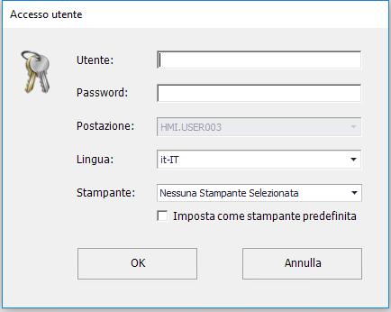

---
tags:
---
# ACCESSO A MASTER FACTORY

## PERMESSI D'ACCESSO

*MASTER Factory®* prevede l'accesso al sistema tramite autenticazione: ogni utente che opererà nel sistema dovrà essere provvisto di credenziali rilasciate dall'amministratore di sistema, che definirà in totale autonomia quali viste e funzionalità potrà utilizzare il nuovo profilo utente.

## LOGIN

All'avvio di *MASTER Factory^®^* apparirà la maschera di login, dove ogni operatore dovrà autenticarsi per potere accedere al sistema.

*Maschera di login*

I campi proposti sono i seguenti:

| Campo | Descrizione |
| :---- | :---- |
| `Utente` | Inserire qui la username fornita dall'amministratore di sistema. |
| `Password` | Inserire qui la password personale. |
| `Postazione` | Al primo accesso, dal menu a tendina selezionare il nome della postazione tra quelli proposti. Questa impostazione non sarà più modificabile dopo l'accesso. |
| `Lingua` | Selezionare la lingua desiderata. |
| `Stampante` | Selezionare la stampante a cui ci si vuole collegare. Spuntando l'opzione `Imposta come stampante predefinita`, *MASTER Factory^®^* ricorderà la vostra scelta al prossimo accesso. |

Per eseguire l'accesso cliccare sul tasto `OK`. In alternativa, cliccare su `ANNULLA` per annullare l'operazione.
