# PIANIFICAZIONE

La sezione `PIANIFICAZIONE` prevede la gestione degli ordini e la loro pianificazione.

## STRUTTURA DI UNA COMMESSA

Gli Ordini di lavoro, anche denominati ODL o Production Request, rappresentano l'insieme di attività necessarie per produrre un determinato articolo. Tale attività può essere formata da *1* a più fasi lavorative. Pur non essendo obbligatorio è possibile raggruppare più ordini di lavoro in Commesse. Dal punto di vista grafico, una commessa appare come l'immagine sottostante:

## ORDINE DI PRODUZIONE

| icona | funzionalità |
| ---- | ---- |
| 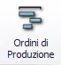 | La maschera Ordine di Produzione provvede a dare una panoramica totale degli ordini di lavoro in corso. |

In questa maschera, la scelta della macchina o del reparto di produzione dall'albero nodi non inficia nessuna azione di filtering sui dati. Gli unici filtri applicabili sono i seguenti:

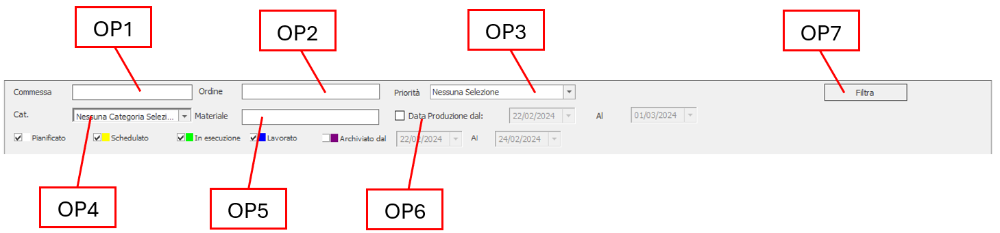

| | Voce | Descrizione |
| :---- | :---- | :---- |
| OP1 | Commessa | Identificativo della commessa da ricercare |
| OP2 | Ordine | Numero dell'ordine da ricercare |
| OP3 | Priorità | Consente di filtrare le fasi per ordine di priorità |
| OP4 | Categoria | Categoria del materiale |
| OP5 | Materiale | Identificativo del materiale |
| OP6 | Data produzione | È possibile impostare una data inizio e fine produzione |

È possibile visualizzare i seguenti stati spuntando la corrispondente casella:

| Colore | Stato |
| ------ | ------ |
| &nbsp; | Pianificato |
| &nbsp; | Schedulato |
| &nbsp; | In Esecuzione |
| &nbsp; | Lavorato |
| &nbsp; | Archiviato (filtrabile anche per arco temporale DAL/AL) |

Al termine della compilazione dei filtri, per eseguire la ricerca cliccare sul tasto `Filtra` **OP7**.

### CREAZIONE NUOVO ORDINE DI PRODUZIONE

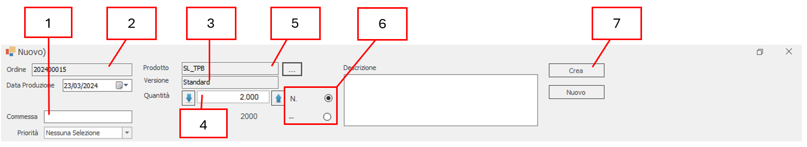

|     | Nome     | Descrizione                                 |
|-----|----------|---------------------------------------------|
| 1   | Commessa | Identificativo della commessa               |
| 2   | Ordine   | Numero dell'ordine di produzione            |
| 3   | Versione | Versione dell'ordine di produzione          |
| 4   | Quantità | Quantità prodotto da produrre               |
| 5   | Prodotto | Categoria di prodotto che si vuole produrre |
| 6   | UoM      | Unità di misura                             |
| 7   | Crea     | Conferma creazione ordine di produzione     |

Utilizzando il tasto {style="width:1.4em"} si aprirà la seguente finestra nella quale si potrà selezionare il prodotto desiderato:

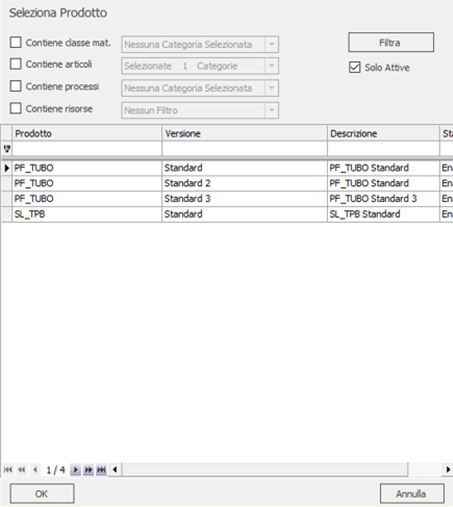

La griglia degli ordini di lavoro è così composta:

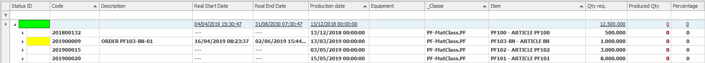

La riga evidenziata in azzurro rappresenta la commessa, mentre quelle evidenziate in giallo rappresentano gli Ordini di lavoro. Quando l'ordine di lavoro viene espanso nei dettagli, esso mostra tutte le fasi di lavoro (riga evidenziata in verde nell'immagine sottostante).

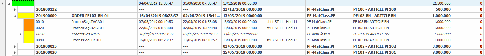

Tramite la selezione delle righe corrispondenti agli ODL, nella parte bassa del *form* viene mostrato il dettaglio di tutte le informazioni associate alle fasi all'ordine (es. note, materiali, operatori, macchine ecc.).

Le funzionalità disponibili per ogni ordine di lavoro sono:

- DISPATCH
- RILASCIO
- CAMBIO STATO
- SPLIT

### DISPATCH DI UN ODL

L'esecuzione del `dispatch` è applicabile ai soli ODL che presentano fasi nello stato PIANIFICATO. Tramite questa funzionalità l'operatore può schedulare ogni fase nell'equipment preferito.

Supponiamo di avere un ordine di lavoro numero '201900009', composto da 4 fasi, di cui una è composta a sua volta da 2 sottofasi.

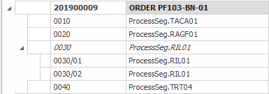

Come si può notare lo status è di colore bianco, ciò significa che
l'intero ordine è nello stato PIANIFICATO.

Cliccando sul tasto `Dispatch` si apre la maschera sotto riportata, che permette di associare le varie fasi agli equipment. Non è necessario selezionare l'ordine per il quale si effettua l'operazione di dispatching, perché il sistema provvede a mostrare sempre tutte le fasi che sono in stato PIANIFICATO (in base ai dati ottenuti in fase di ricerca).

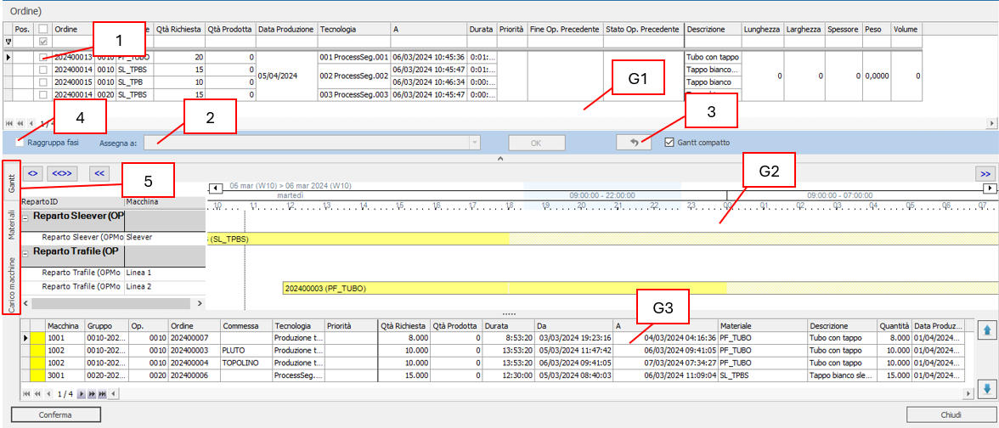

Selezionando la fase **1** per cui si desidera assegnare un equipment, il sistema provvederà a suggerire tutte le fasi che hanno la stessa tipologia di processo di quella selezionata, al fine di rilasciarle tutte e valutare il carico macchine. Per eseguire l'assegnazione, dopo aver spuntato le fasi desiderate, cliccare sull'elenco **2** dove saranno presenti tutti gli equipment assegnabili. Una volta assegnato
l'equipment, lo stato della fase passa da PIANIFICATO a SCHEDULATO; pertanto, non sarà più visibile nell'elenco delle fasi in dispatching **G1**, ma sarà presente nella griglia **G2** e nel gantt sottostante **G3**.

In caso di errore o ripensamento: selezionare la fase schedulata e cliccare sul tasto  **3** in modo da annullare l'associazione e riportarla in stato PIANIFICATO.

Spuntando il checkbox **4** `Raggruppa fasi` tutte le fasi selezionate, oltre ad avere lo stesso equipment, assumono uno stato di unione fino al termine dell'esecuzione. Le fasi rimangono unite a seguito di:

- Cambio macchina
- Cambio stato
- Rischedulazione

Eseguito il lavoro di dispatching il risultato finale sarà questo:

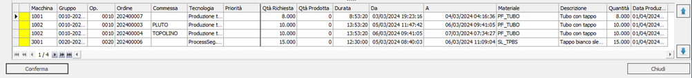

Evidenziato in giallo, tutte le fasi che ora hanno l'associazione a un
equipment. Cliccando sul tasto `Materiali` **5** si visualizza lo storico a magazzino
dei materiali:

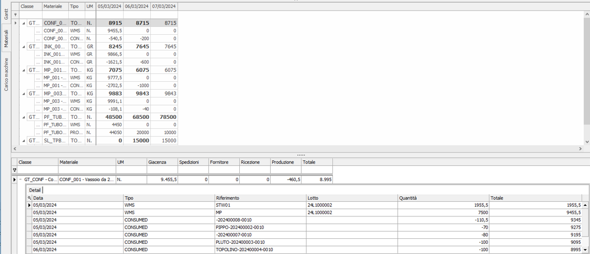

Selezionando la sezione `Carico macchine` **5,** si visualizza un grafico rappresentante il tempo di carico di ogni singola macchina.

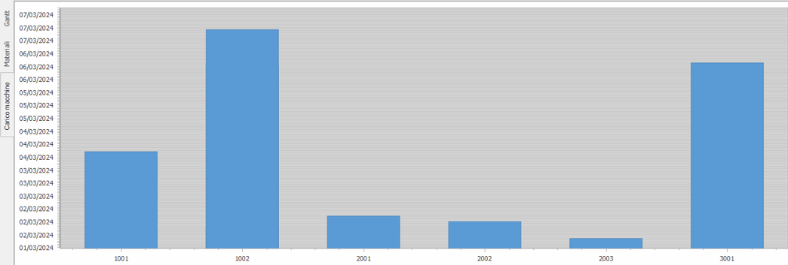

Per confermare l'intera operazione è necessario cliccare sul tasto `CONFERMA`, affinché le fasi siano validamente schedulate.

### RILASCIO

È simile al dispatch ma agisce solo sulle fasi dell'ordine selezionato.

### CAMBIO STATO

Permette di cambiare stato - sia a una singola fase sia a tutto l'ordine - cliccando sulla riga della griglia. Gli stati sono qui di seguito rappresentati:

A seconda dello stato corrente dell'ordine / fase scelta alcuni stati potrebbero non essere assegnabili. In questo caso, il tasto non sarà attivo.

### SPLIT DI UNA FASE

La fase si può suddividere in più sottofasi nel modo di seguito descritto: selezionare la fase che si desidera dividere e cliccare sul tasto `Split`. Tale operazione fa aprire la maschera sottostante:

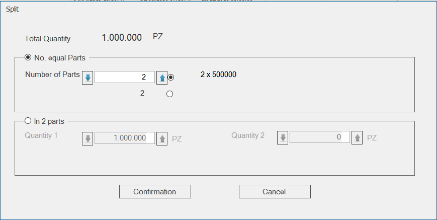

La *form* permette di suddividere la fase in due modi:

- In più parti uguali, mediante l'utilizzo del box **B1**, dove l'operatore decide solo il numero di parti **1** e il sistema provvede a ripartire la quantità da produrre in modo equo su ogni parte **2**.
- Dividere in due parti, ma lasciando all'operatore la scelta sulla quantità da produrre per ogni singola parte **B2**.

Confermando tramite il tasto `Conferma`, il risultato ottenuto sarà il seguente:

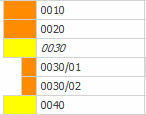

L'operazione di Splitting è irreversibile: una volta che la suddivisione della fase in sottofasi è stata eseguita, non sarà più possibile né riunire le fasi né modificarne le quantità da produrre.

### DETTAGLIO DELLA FASE

In ogni fase, cliccando sulla riga, vengono visualizzati tutti i dettagli a essa associati, nella parte bassa della *form*.

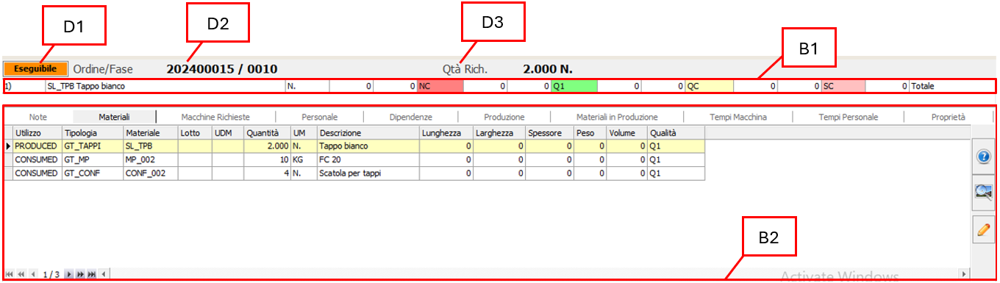

Nello specifico, è possibile vedere:

- **D1** - Status della fase
- **D2** - Numero dell'ordine e della fase
- **D3** - Quantità da produrre
- **B1** - Si trovano i seguenti dati relativi alla produzione:

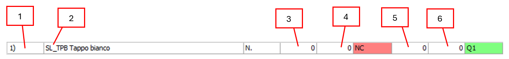

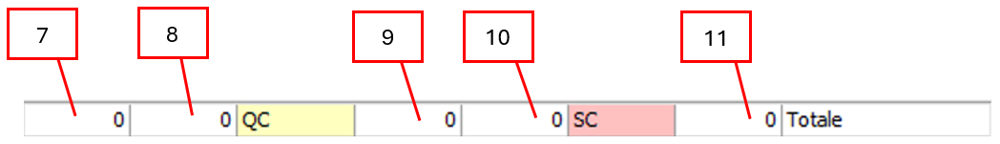

| | Descrizione | | Descrizione |
| :--: | :---- | :----: | :---- |
| 1 | Numero di materiale di tipo PRODUCED | 7 | Quantità pezzi prodotti in qualità conforme QC |
| 2 | Descrizione dell'ordine di lavoro | 8 | Numero di UDM prodotti in qualità conforme QC |
| 3 | Quantità pezzi prodotti in qualità NC (non conforme) | 9 | Quantità pezzi prodotti in qualità SC (scarto) |
| 4 | Numero di UDM prodotti in qualità NC (non conforme) | 10 | Numero di UDM prodotti in qualità SC (scarto) |
| 5 | Quantità pezzi prodotti in qualità Q1 (conforme) | 11 | Sommatoria di tutte le quantità di ogni qualità |
| 6 | Numero di UDM prodotti in qualità Q1 (conforme) | | |

Il box **B2** è suddiviso in schede e prevede le seguenti sezioni:

- Note
- Materiali
- Macchine richieste
- Personale
- Dipendenze
- Produzione
- Materiali in produzione
- Tempi Macchina
- Tempi Personale
- Proprietà

#### NOTE DELLA FASE

Nella scheda note è possibile inserire delle note destinate a essere visualizzate da tutti coloro che gestiranno la fase selezionata. Le operazioni disponibili sono:

|  | Descrizione |
| ---- | :---- |
| 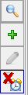 | Permette di visualizzare il messaggio Permette di creare un nuovo messaggio Modifica un messaggio già esistente Abilita la visualizzazione pop-up |

Durante la creazione di un messaggio vengono richiesti i seguenti valori:

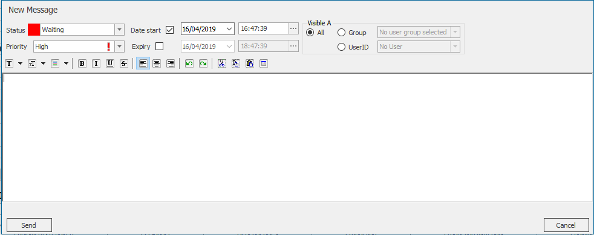

| Campo | Descrizione |
| :-- | :-- |
| Stato</strong> | Lo stato del messaggio è selezionabile da un menù a tendina i cui valori sono configurabili come `Configurazione` 🡪 `Configuratore🡪` `Generali` 🡪 `Causali` |
| Priorità | Priorità del messaggio: Alta, media, bassa |
| Data Inizio | Data d'inizio visualizzazione messaggio |
| Scadenza | Data in cui il messaggio non deve essere più visualizzato |
| **Visibile a** | |
| Gruppo | Seleziona il gruppo di utenti che possono visualizzare il messaggio |
| Utente | Seleziona l'utente che può visualizzare il messaggio |

Dopo aver inserito il messaggio nell'area di testo **1**, cliccare sul tasto `Invio` **2** per confermare l'invio.

#### MATERIALI

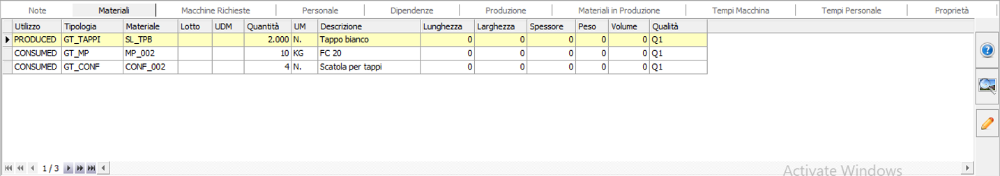

La scheda materiali è utilizzabile per la consultazione e permette la visualizzazione (in formato tabellare) dei materiali che vengono trattati nella fase selezionata (Consumed, consumable ecc…).

I seguenti tasti sono situati di fianco alla griglia riepilogativa:

-  Permette di conoscere quante udm sono presenti in magazzino in relazione all'articolo della riga selezionata sulla griglia
- 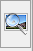 Permette di visualizzare degli allegati associati ai materiali in relazione all'articolo della riga selezionata sulla griglia
- 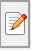 Permette di modificare le proprietà del materiale/prodotto selezionato.

#### MACCHINE

In questa scheda è possibile vedere le macchine che sono disponibili per la fase selezionata. Per modificare la macchina assegnata a una fase, cliccare sul tasto  il software provvederà a mostrare una maschera che permette di assegnare alla fase una nuova macchina tra quelle presenti in elenco.

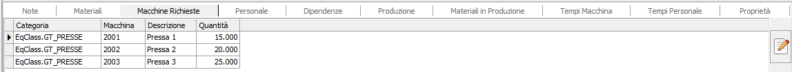

#### PERSONALE

In questa griglia è solo possibile consultare l'elenco del personale assegnato alla fase selezionata.

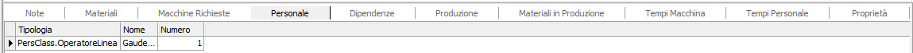

#### DIPENDENZE

Nella scheda `dipendenze` sono mostrate due griglie che evidenziano le dipendenze di esecuzione tra le varie fasi. Nell'immagine sottostante si evince che la fase selezionata **0030** avrà luogo solo dopo che sarà terminata la fase **0020**

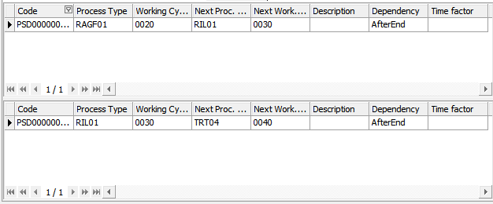

#### PRODUZIONE, MATERIALI IN PRODUZIONE, TEMPI MACCHINA, TEMPI PERSONALE

I dati descritti in queste schede sono gli stessi spiegati nel capitolo `ANALISI DATI` 🡪 `PRODUZIONE`.

#### PROPRIETÀ

Nella scheda `proprietà` sono descritte tutte le proprietà relativa alla fase selezionata. Nello specifico, è possibile modificare eventuali valori (nei limiti delle autorizzazioni permesse all'utente).

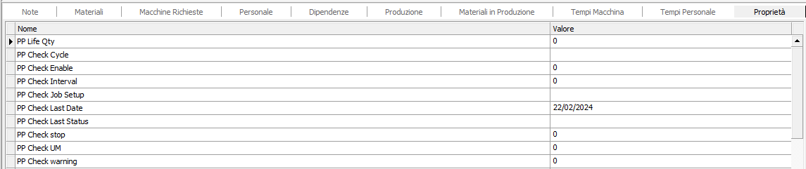

## FUNZIONE DI PIANIFICAZIONE FASI

| Icona | Funzionalità |
| ---- | :---- |
|  | La maschera di pianificazione offre una panoramica di tutte le fasi lavorative e la gestione della loro schedulazione. |

I dati presenti in questa maschera variano in base al reparto di produzione o alla macchina selezionati nell'albero nodi A e sono:

- Elenco della / delle fasi lavorative ordinate per data esecuzione
- Gantt delle / della macchina selezionata
- Gantt delle commesse
- Sequenze
- Elenco dei materiali richiesti

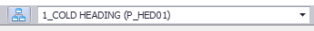

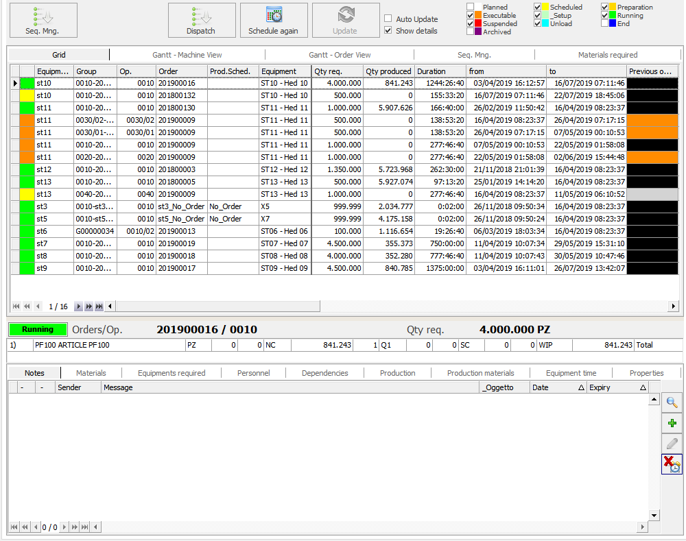

### ELENCO DELLE FASI LAVORATIVE ORDINATE PER DATA ESECUZIONE

Nel box **P7** sono mostrate tutte le operazioni che dovrebbero essere eseguite sulla / sulle macchine selezionate **A**, in ordine di esecuzione.

### GANTT DELLE O DELLA MACCHINA SELEZIONATA

Il gantt macchina mostra la disposizione temporale delle fasi lavorative riferite alla macchina / macchine scelte.

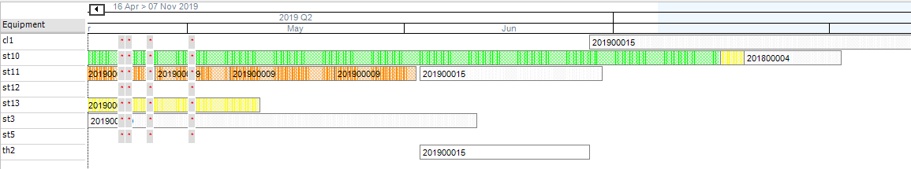

Nell'esempio grafico è stata selezionata l'intera area di produzione, ma vengono mostrate solo le macchine per cui esistono degli ordini.

### GANTT DELLE COMMESSE

Il gantt delle commesse mostra la disposizione temporale delle fasi lavorative riferite alle commesse nelle macchine scelte dall'albero nodi **A**.

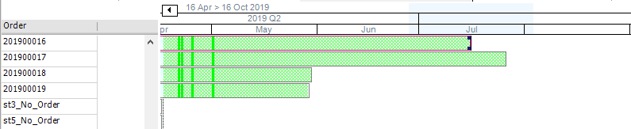

### SEQUENZA

L'interfaccia delle sequenze è pari a quella ottenuta tramite la pressione del tasto `Sequenza` , che verrà descritta più avanti.

### ELENCO DEI MATERIALI UTILIZZATI

L'elenco dei materiali utilizzati mostra la richiesta dei materiali richiesti dalle fasi lavorative.

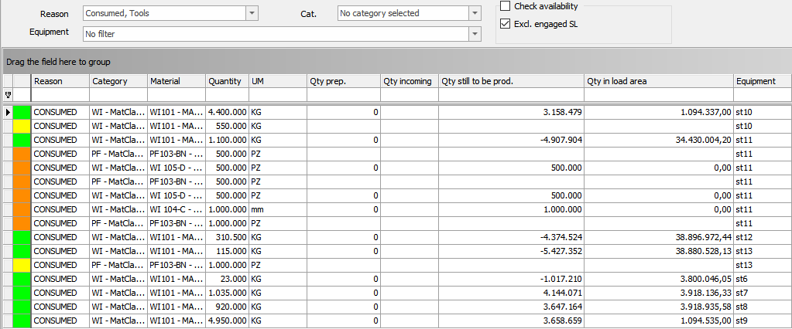

L'elenco dei materiali richiesti è filtrabile anche secondo i seguenti attributi:

- Utilizzo
- Categoria
- Macchina

È inoltre possibile vedere le disponibilità spuntando la voce `Calcola Disponibilità`. Nel caso si desideri che vengano omessi gli UDM già impegnati, durante la fase di calcolo, allora si deve spuntare la voce `Escludi Impegnate`.

### FILTRAGGIO DATI

Tutti i dati visibili nelle schede sopra elencate possono essere filtrati secondo il loro stato **P6**.

| Colore | Pianificato |
| :----- | :---------- |
| &nbsp; | Schedulato |
| &nbsp; | Preparazione |
| &nbsp; | Eseguibile |
| &nbsp; | Setup |
| &nbsp; | In Esecuzione |
| &nbsp; | Sospeso |
| &nbsp; | Scaricamento |
| &nbsp; | Lavorato |
| &nbsp; | Archiviato |

### AGGIORNAMENTO AUTOMATICO DEI DATI

Per rendere automatico l'aggiornamento dei dati, mettere la spunta sul checkbox `Auto Aggiorna` **P5**. Il sistema provvede ad aggiornarsi al verificarsi di ogni evento riguardante gli ordini. In totale autonomia.

### AGGIORNAMENTO MANUALE DEI DATI

Per non rendere automatico l'aggiornamento della lista operazioni, omettere la spunta sul checkbox `Auto Aggiorna` **P5**. Il sistema controlla se vi sono variazioni di stato; qualora si verificasse questa condizione, il tasto  `Aggiorna` **P4** si attiva e l'operatore può aggiornare i dati manualmente.

Qualora si desideri un maggiore spazio visivo per la visualizzazione delle fasi lavorative, lo si può ottenere eliminando la spunta dal checkbox `Mostra dettaglio` **P5**. nascondere il box **P8** contenente il dettaglio delle fasi. Tale dettaglio è stato descritto nei capitoli precedenti.

### TASTO SEQUENZA

 **P1** Il tasto sequenza permette di aprire una *form* che mostra tutte le fasi, macchina per macchina; selezionare lo stato che si desidera vedere tramite gli appositi filtri **S1**.

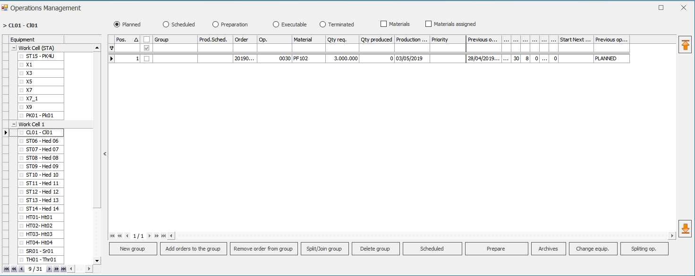

Le operazioni ammissibili in questa *form* dipendono dallo status selezionato in **S1**.

| STATO ATTIVO | OPERAZIONE AMMISSIBILI |
| :-- | :-- |
| PIANIFICATO | Nuovo Gruppo |
| | Rilascia in schedulato |
| | Archivia |
| | Cambio Macchina |

#### NUOVO GRUPPO

Permette di raggruppare una serie di fasi in un unico gruppo, per fare ciò cliccare sul tasto `Nuovo Gruppo`, che fa aprire la seguente maschera:

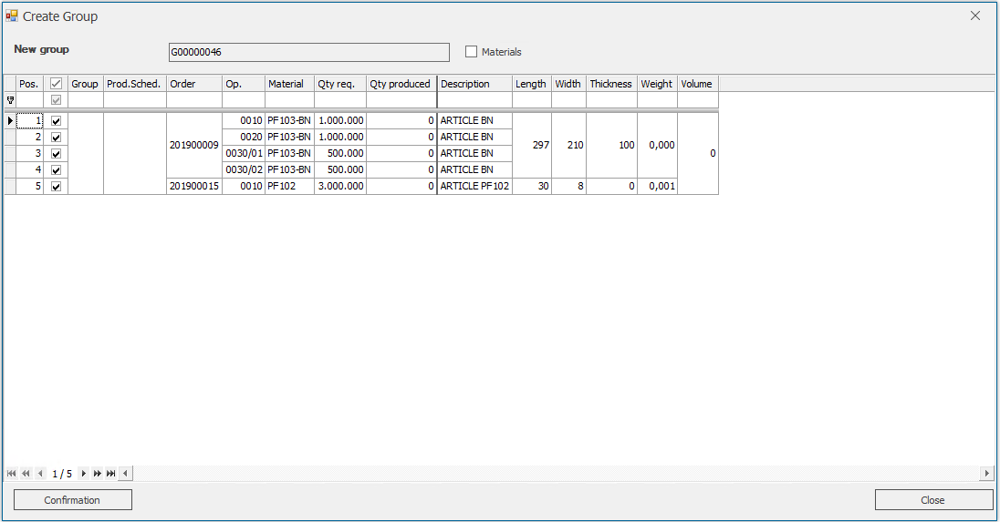

Ora si devono selezionare le fasi cliccando sulla relativa casella, nell'ordine preferito. Spuntando la casella `materiali` vengono mostrati i materiali di ogni fase, allo scopo di migliorare l'accuratezza del raggruppamento. Una volta eseguite le selezioni, cliccando sul tasto `Conferma` si ottiene il seguente risultato:

Senza gruppo
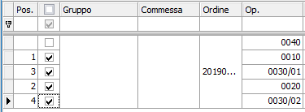

Con il gruppo
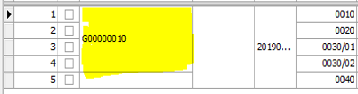

#### RILASCIA IN SCHEDULATO

Permette di cambiare stato alla fase selezionata, facendola passare da `PIANIFICATA` 🡪 `SCHEDULATA`.

Nota: la fase non potrà essere schedulata se viene rilasciata in `scheduled` allorché le fasi che la precedono sono ancora in fase di `planned`.

#### ARCHIVIA

Permette di archiviare un ordine.

#### CAMBIA MACCHINA

Permette di cambiare la macchina attribuita.

#### OPERAZIONI AMMISSIBILI IN STATO SCHEDULATO

| STATO ATTIVO | OPERAZIONE AMMISSIBILI |
| :-- | :-- |
| SCHEDULATO | Aggiungi ordini al Gruppo |
| | Rimuovi ordine dal gruppo |
| | Split/Join Gruppo |
| | Annulla Rilascio |
| | Rilascia in preparazione |
| | Rilascia in eseguibile |
| | Cambio Macchine |
| | Split Fase |
| | Rischedula |

##### AGGIUNGI ORDINI AL GRUPPO

Permette di aggiungere a un gruppo delle fasi di tipo `PIANIFICATE`. Per eseguire questa operazione, dopo aver selezionato il gruppo per il quale si desidera aggiungere fasi esistenti, cliccare sul tasto `Aggiungi ordini al Gruppo`. Questa operazione fa aprire una maschera che contiene tutte le fasi che non appartengono a nessun gruppo: tramite la selezione di tali fasi e la conferma di tutto, esse vengono aggiunte al gruppo di partenza.

##### RIMUOVI ORDINE DAL GRUPPO

Permette di rimuovere una fase da un gruppo. Per eliminare una fase da un gruppo, selezionarla tramite il relativo checkbox, poi cliccare sul tasto `Rimuovi ordine dal gruppo`. In questo modo la fase viene rimossa dal gruppo e resta visibile nella lista delle fasi in stato `PIANIFICATA`.

##### SPLIT/JOIN GRUPPO

Permette di manipolare i gruppi esistenti. Nello specifico, questa funzione suddivide i gruppi in ulteriori gruppi oppure permette di unirli.

##### SUDDIVISIONE DI UN GRUPPO

Per suddividere un gruppo esistente, selezionare una fase qualsiasi del gruppo tramite checkbox, poi cliccare sul tasto `Split/Join Gruppo`. In questo modo, la maschera ottenuta è visualizzata come sotto mostrato:

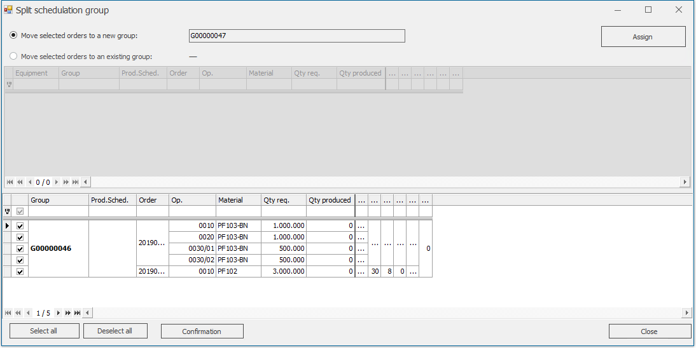

Ora è possibile selezionare le fasi che si desidera estrarre dal gruppo: lasciare selezionata la voce `sposta gli ordini selezionati in un nuovo gruppo` e cliccare su `Assegna`.

Il risultato è il seguente:

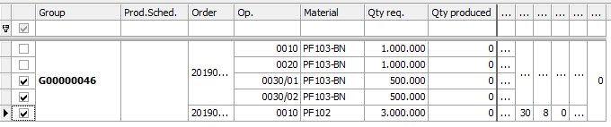
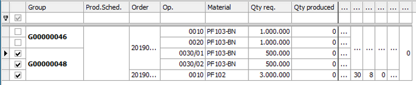

Nell'esempio sopra riportato sono state spostate le fasi 0030 (PF 103-BN) e 0010 (PF 102) dal gruppo G00000046 a un nuovo gruppo (generato automaticamente dal sistema) G00000048

##### UNIONE DI UN GRUPPO

per unire uno o più gruppi, selezionare una fase del gruppo che si desidera unire, poi cliccare sul tasto `Split/Join Gruppo`. La maschera che si ottiene è come quella di seguito mostrata:

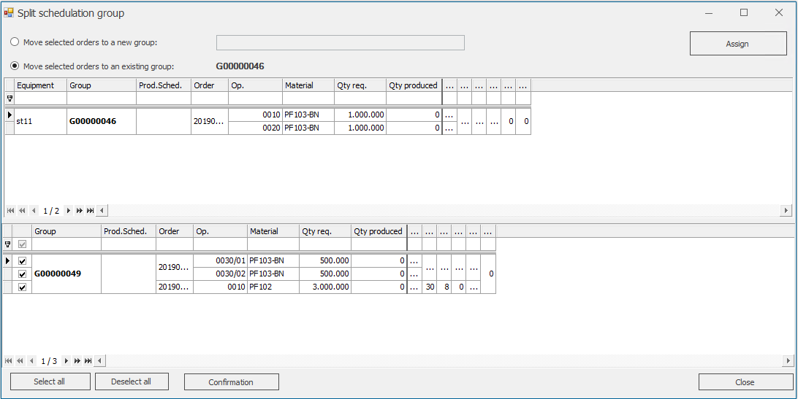

Selezionando la voce `Sposta gli ordini selezionati in un Gruppo esistente` si abilita il pannello **P1** dove si trova l'elenco di tutti i gruppi e nel quale si può spostare le fasi selezionate del pannello **P2**. Per spostare una o più fasi, selezionare le fasi, poi cliccare sul tasto `Assegna`. Per validare (e rendere effettive) le modifiche, cliccare sul tasto `Conferma`.

##### ANNULLA RILASCIO

Permette di spostare un gruppo o una singola fase dallo stato attuale a quello "PIANIFICATO".

Nota: durante questa procedura vengono eliminati tutti i raggruppamenti eseguiti in precedenza, riportando l'ordine nel suo stato originale.

##### RILASCIA IN PREPARAZIONE

Permette d'impostare lo stato della fase selezionata in "PREPARAZIONE".

##### RILASCIA IN ESEGUIBILE

Permette d'impostare lo stato della fase selezionata in "ESEGUIBILE".

##### CAMBIO MACCHINA

Permette di cambiare la macchina dell'ordine o della singola fase selezionata.

##### SPLIT FASE

Permette di suddividere una fase in più sottofasi.

##### RISCHEDULA

Riavvia la routine di schedulazione.

#### OPERAZIONI AMMISSIBILI NELLO STATO "PREPARAZIONE"

| STATO ATTIVO | OPERAZIONE AMMISSIBILI |
| :-- | :-- |
| PREPARAZIONE | Rimuovi ordini dal gruppo |
| | Rilascia in eseguibile |
| | Annulla rilascio |
| | Cambio Macchina |

##### RIMUOVI ORDINE DAL GRUPPO

Permette di rimuovere una fase da un gruppo. Per eliminare una fase da un gruppo, selezionarla tramite il relativo checkbox, poi cliccare sul tasto `Rimuovi ordine dal gruppo`. In questo modo, la fase viene rimossa dal gruppo; resta visibile nella lista delle fasi in stato `PIANIFICATA`.

##### RILASCIA IN ESEGUIBILE

Permette d'impostare lo stato della fase selezionata in `ESEGUIBILE`.

##### ANNULLA RILASCIO

Permette di modificare lo stato di una singola fase o di tutte le fasi appartenenti ad un gruppo riportandole allo stato `PIANIFICATO`.

*Nota:* durante questa procedura vengono eliminati tutti i raggruppamenti eseguiti in precedenza, riportando l'ordine nel suo stato originale.

##### CAMBIO MACCHINA

Permette di cambiare la macchina della fase selezionata.

### OPERAZIONI AMMISSIBILI IN STATO ESEGUIBILE

| STATO ATTIVO | OPERAZIONE AMMISSIBILI |
| ESEGUIBILI | Rilascia in preparazione |
| | Annulla rilascio |
| | Cambia macchina |

##### RILASCIA IN PREPARAZIONE

Permette d'impostare lo stato della fase selezionata in `PREPARAZIONE`.

##### ANNULLA RILASCIO

Permette di modificare lo stato di una singola fase o di tutte le fasi appartenenti a un gruppo riportandole allo stato `PIANIFICATO`.

> [!Note]
> Durante questa procedura vengono eliminati tutti i raggruppamenti eseguiti in precedenza, riportando l'ordine nel suo stato originale.

##### CAMBIO MACCHINA

Permette di cambiare la macchina della fase selezionata.

#### OPERAZIONI AMMISSIBILI IN STATO TERMINATO

| STATO ATTIVO | OPERAZIONE AMMISSIBILI |
| TERMINATO | Riporta in pianificato |
| | Archivia |

##### RIPORTA IN PIANIFICATO

Permette d'impostare lo stato della fase selezionata in `PIANIFICATO` solo quando la quantità prodotta sia inferiore alla quantità richiesta.

##### ARCHIVIA

Permette di archiviare definitivamente un Ordine.

### TASTO DISPATCH

**P2** permette di eseguire il dispatching delle fasi**.** Tale funzionalità è stata descritta nel capitolo [Dispatch di un OdL](#dispatch-di-un-odl).

### TASTO RISCHEDULA

**P3** Permette di avviare manualmente la routine di schedulazione degli ordini.

### TASTO AGGIORNA

**P4** Permette di aggiornare l'interfaccia utente. Normalmente, questo tasto è disabilitato: viene abilitato in automatico dal sistema solo al verificarsi di determinati eventi che riguardano gli ordini e quando non è abilitato l'auto aggiornamento automatico.
