# ANALISI DATI

La sezione analisi dati serve per monitorare la produzione, gestire le performance anche in realtime, monitorare i tempi di produzione e visualizzare e stampare reportistiche secondo le proprie necessità.

## PRODUZIONE

| icona | funzionalità |
| ---- | ---- |
|  | Questa *form* permette di monitorare lo status degli ordini, analizzando i tempi e lo status delle macchine e l'utilizzo dei materiali. |

L'interfaccia della *form* di produzione è così rappresentata:

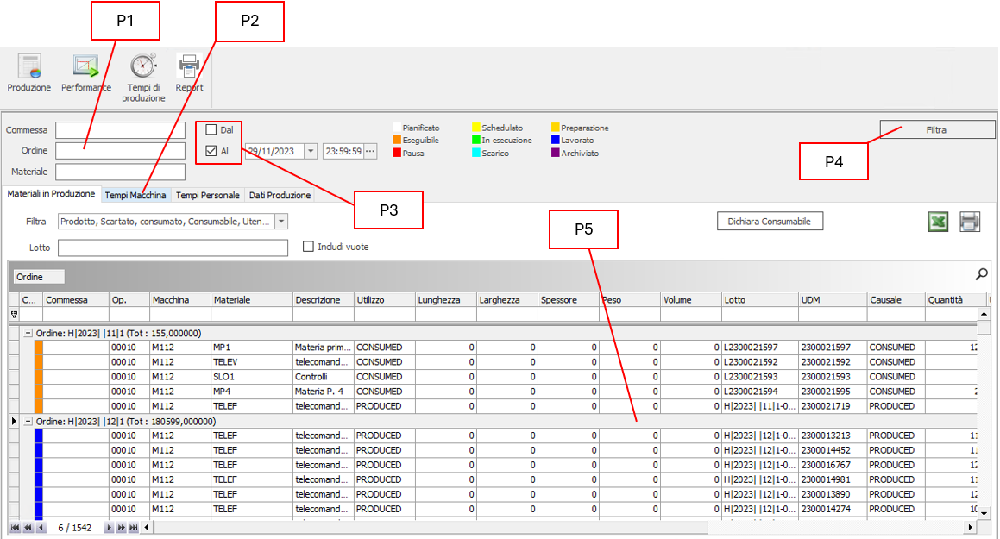

### SEZIONE FILTRI

La scheda di produzione elabora i dati al fine di ottenere un quadro completo dello status degli ordini. Tenuto conto che la mole di dati potrebbe essere molto elevata è necessario impostare preventivamente uno o più filtri di ricerca e poi cliccare sul tasto `Filtra` (P4). I filtri disponibili sono:

| FILTRI PER LA RICERCA DEGLI ORDINI | |
| :---- | -- |
| COMMESSA | Impostare su questa voce il riferimento della commessa da ricercare |
| ORDINE | Impostare su questa voce il numero d'ordine da ricercare |
| MATERIALE | Impostare su questa voce il codice del materiale da ricercare |
| DAL | Data inizio produzione |
| AL | Data fine produzione |

### MATERIALI IN PRODUZIONE

La scheda "materiali in produzione" offre una griglia che mostra tutti gli ordini che soddisfano i vincoli impostati in fase di filtraggio dati. Ogni riga che compone la griglia inizia con un color che rappresenta lo status dell'ordine:

| Colore | Stato |
| :----- | :---------- |
| &nbsp; | Schedulato |
| &nbsp; | Preparazione |
| &nbsp; | Eseguibile |
| &nbsp; | Setup |
| &nbsp; | In Esecuzione |
| &nbsp; | Sospeso |
| &nbsp; | Scaricamento |
| &nbsp; | Lavorato |
| &nbsp; | Archiviato |

È possibile filtrare ulteriormente la vista dei risultati ottenuti agendo sul menu a tendina "FILTRA", che mostra l'elenco dei campi utilizzabili. Nello specifico:

- Prodotto
- Consumato
- Consumabile
- Utensili
- Scartato
- Sfrido

È possibile eseguire anche una ricerca ristretta sul numero del lotto, inserendolo nel campo "LOTTO".

Per rendere effettiva l'applicazione di quest'ultimi ulteriori filtri, si deve sempre cliccare sul tasto "FILTRA".

Nota: i filtri presenti nella scheda "materiali in produzione" agiscono solo sulla scheda corrente.

#### DICHIARA CONSUMABILE

Per i materiali di tipo "CONSUMABLE", qualora si desideri impostare manualmente la quantità di materiale utilizzato.

Questa funzionalità potrebbe tornare utile nei seguenti casi:

1. Per correggere errori provenienti dalla produzione (errore di conteggio in ingresso o uscita dalla linea).
2. Correzione per adeguare il consumo teorico a quello effettivo dei componenti consumati.

**Esempio 1**:

Per impostare manualmente una quantità, cliccare sul tasto `dichiara consumabile`; si aprirà una *form* che riporta le righe della selezione corrente relative agli utilizzi dei materiali CONSUMABLE. Nella colonna evidenziata in rosso, nella figura sottostante, sono mostrate le quantità d'utilizzo previste, mentre quelle evidenziate in giallo sono le quantità effettive che l'operatore può modificarle manualmente.

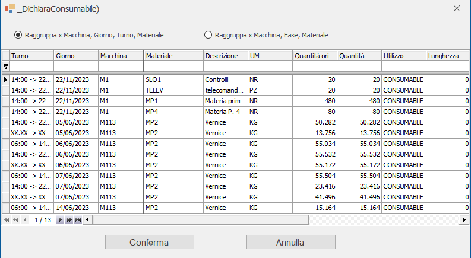

È possibile impostare le quantità del materiale utilizzato in due modalità

1. Utilizzando la funzione "raggruppa x macchina, giorno, turno, materiale"
   Selezionando questa funzione è possibile immettere il valore del materiale effettivamente utilizzato su ogni macchina per ogni giorno lavorativo e per ogni turno.
2. Utilizzando la funzione "raggruppa x macchina, fase, materiale"
   Selezionando questa funzione, il sistema raggrupperà il materiale per ogni fase lavorativa di ogni macchina e per ogni ordine. A differenza della selezione precedente, questa mostra il totale dell'utilizzo; pertanto, in fase di correzione della quantità effettiva, il sistema provvede in automatico a ripartire, in modo equo e su ogni turno, la quantità di materiale effettivamente utilizzata.

**ESEMPIO 2**:

Esiste un materiale per un ordine il cui utilizzo è di tipo "Consumabile" e fa riferimento a un barattolo di colla da 10 litri. Considerato che l'operatore ne utilizza solo 500gr, egli può impostare manualmente la grammatura effettiva utilizzata selezionando la riga relativa a questo materiale e poi cliccando sul tasto `Dichiara Consumabile`.

#### ESPORTAZIONE DATI{#esportazione-dati-materiali-in-produzione}

Tutti i risultati possono essere esportati in Excel o stampati agendo sui tasti 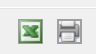.

### TEMPI MACCHINA

In questa scheda è mostrata la visualizzazione degli ordini, da raggruppare secondo le proprie esigenze. Nel proseguo della spiegazione, questo sarà utilizzato come esempio di raggruppamento:

Il risultato è il seguente:

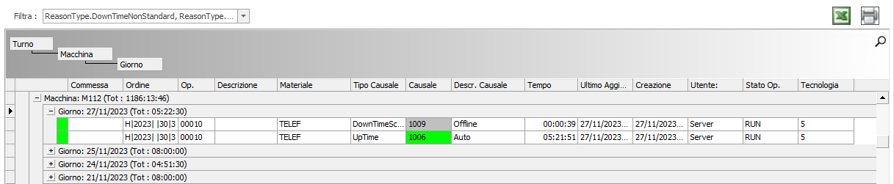

La griglia, dopo essere stata raggruppata per: `Turno` &#10132; `Macchina` &#10132; `Giorno`, mostra i dati visualizzati: quello con maggior rilevanza è il codice dello status macchina, identificato sia in modo alfanumerico sia visivo tramite i seguenti colori di base

| Colore | Descrizione | Colore | Descrizione |
| :----- | :---- | :----- | :----- |
| &nbsp; | Fermo non pianificato | &nbsp; | Setup |
| &nbsp; | In esecuzione | &nbsp; | Manutenzione |
| &nbsp; | Fermo pianificato | | |

> [!Note]
> I colori possono variare a seconda delle preferenze impostate nella configurazione di sistema, alla voce `Configuratore` &#10132; `Generale` &#10132; `Causali`

### TEMPI PERSONALE

Scheda molto simile a quella dei tempi macchina, solo che al suo interno si può visualizzare l'intera attività del personale.

## PERFORMANCE

| Icona | Funzionalità |
| ---- | ---- |
| 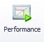 | In questa *form* viene monitorato lo status dell'impianto: disponibilità, efficienza e tasso di qualità. Ossia, ciò che è definito come [O.E.E.](#calcolo-oee) |

### CALCOLO O.E.E.

L'O.E.E (overall equipment effectivess) riassume in sé tre diversi concetti:

- la disponibilità
- l'efficienza
- il tasso di qualità di un impianto.

La formula per calcolare l'O.E.E. è così espressa:

$$ \text{OEE} = \text{Availability} \times \text{Efficiency} \times \text{Quality} $$

Dove:

$$ \text{Availability \%} = (\text{Uptime} ) / \text{ AvailableTime} \times 100$$

$$ \text{Efficiency \%} = (\text{RealProduction } ) / \text{ TheoricalProduction} \times 100$$

$$ \text{Quality \%} = (\text{GoodProducts } ) / \text{ RealProduction} \times 100$$

**DownTimeNonStandard** = somma del tempo dei periodi in cui la motivazione di lavoro è stata "DownTimeNonStandard".
**DownTimeSchedule** = somma del tempo dei periodi in cui la motivazione di lavoro è stata "DownTimeScheduled".
**SetupTime** = somma del tempo dei periodi in cui la motivazione di lavoro è stata "SetupTime".
**UpTime** = somma del tempo dei periodi in cui la motivazione di lavoro è stata "UpTime".
**TotalOperatingTime** = tempo determinato dai turni impostati al netto delle ferie.
**AvailableTime** = TotaleOperatingTime – DownTimeScheduled.
**TheoricalProduction** = Capacità produttiva teorica nel period UpTime.
**RealProduction** = Quantità di prodotti buoni (non scartati) e con qualità Q1, Q2 o NULL.

### INTERFACCIA PERFORMANCE

L'interfaccia della performance come nella figura sottostante:

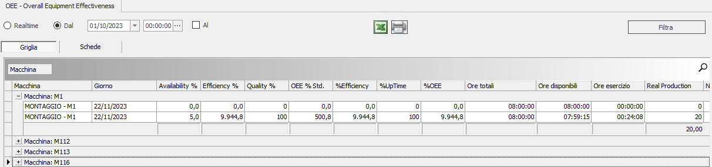

#### FILTRAGGIO DATI{#filtraggio-dati-performance}

È possibile impostare la ricerca su un arco temporale:

1. "Da data a oggi": selezionando la voce "Dal", e impostando la data/ora di partenza, il sistema elabora tutte le operazioni intercorse tra la data settata e quella odierna;
2. "Da data a data": Spuntando la voce "Dal", poi la voce "Al", e impostando il range di data/ora d'inizio e fine, il sistema elabora tutte le operazioni eseguite nell'arco temporale descritto.
3. Realtime: affinché vengano mostrate le informazioni relative ai turni in corso

Ovviamente l'effetto dei filtri si applica nel momento in cui si clicca sul pulsante "FILTRA".

#### ESPORTAZIONE DATI{#esportazione-dati-performance}

Tutti i risultati possono essere esportati in Excel oppure stampati agendo sui tasti .

#### VISUALIZZAZIONE: GRID TAB

Tutti i risultati esportati possono essere visualizzati in 2 modalità:

| Modalità | Descrizione |
| :---- | :---- |
| **GRID** | È la modalità standard con la quale vengono visualizzati i dati ed è quella di default che compare all'avvio della funzione. |
| **TABS** | Fornisce le stesse informazioni ma mostrandole in forma di tabella aggregata. È più comoda per analizzare una singola macchina in un singolo periodo (per esempio nella modalità RealTime) |

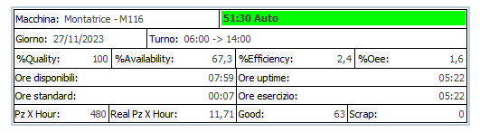

## TEMPI DI PRODUZIONE

| Icona | Funzionalità |
| :---- | :---- |
|  | In questa *form* è possibile monitorare i GANTT relativi ai tempi di produzione di macchine e persone |

### INTERFACCIA DATI

L'interfaccia dei tempi di produzione appare come nella figura sottostante:

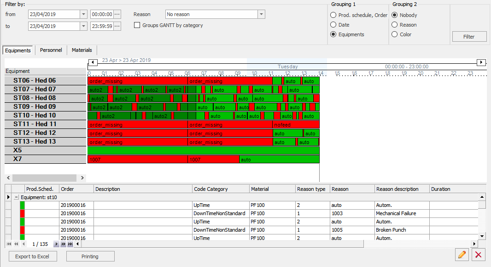

#### FILTRAGGIO DATI{#filtraggio-dati-tempi-di-produzione}

Il filtraggio dati si esegue tramite il box "Filtra per". Nello specifico, si eseguono le seguenti operazioni:

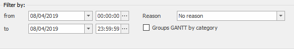

1. "Dal Al": serve per impostare un arco temporale di ricerca;
2. "Causale": impostare la causale/causali che si desidera visualizzare;
3. "Raggruppa per categoria", se selezionato, permette di raggruppare i GANTT per categoria di macchina.

### IMPOSTARE LA CAUSALE DI VISUALIZZAZIONE

Per impostare la causale/i di visualizzazione per la quale si desidera filtrare i GANTT, cliccare sul menu a tendina sotto la voce `Causale`: il comando farà aprire una griglia dove si potrà scegliere la / le causali di filtraggio. La gestione delle categorie delle causali si raggiunge attraverso il seguente percorso: `Configuratore` &#10132; `Generale` &#10132; `Causali` &#10132; `Tipi di causale`.

Le causali si raggiungono attraverso il seguente percorso: `Configuratore` &#10132; `Generale` &#10132; `Causali` &#10132; `Causali`.

Dopo aver cliccato sul menu a tendina "Tipologia Causale"
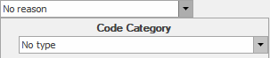

apparirà l'elenco delle categorie disponibili:
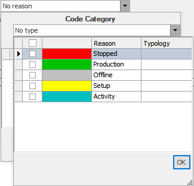

Spuntando la prima colonna, riferita alla categoria della causale preferita, si visualizza l'elenco di tutte le causali disponibili.

Per rendere effettiva la scelta, dopo aver cliccato sul tasto `OK`, cliccare sul tasto `FILTRA`.

La maschera si suddivide in due parti:

1. Gantt
   1. Per Macchine
   2. Per il personale
2. Dettaglio del Gantt
   1. Per Macchine
   2. Per il personale

### LA LETTURA DI UN GANTT

La lettura di un gantt si esegue nel seguente modo:

- Arco temporale giornaliero 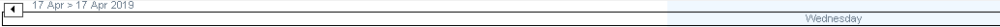

- Fasce orarie della giornata divise in quarti d'ora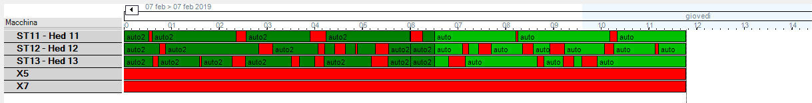

- Elemento su cui si basa il gantt (in esempio una macchina) 

- Status dell'elemento in una determinata fascia oraria
  

Posizionandosi con il mouse sulla barra degli stati, apparire un *tooltip* che mostra la descrizione dello status e la sua durata, incluso la fascia temporale di inizio e fine.

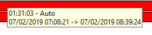

### GANTT PER MACCHINA

Per visualizzare i gantt relativi alle macchine è necessario cliccare sul tasto `Macchine` evidenziato in figura, e di seguito sul tasto `Filtra`

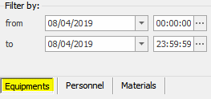

In base alla selezione effettuata nell'albero nodi, che definisce la struttura dello stabilimento, si vedranno:

| se selezionato  | Gantt di tutte le macchine che compongono il reparto |
| ---- | ---- |
| se selezionato {style="width:1em"} | Il solo Gantt della macchina scelta |

Nell'esempio che segue è stata selezionata una production line dall'albero nodi; pertanto, sono visibili più macchine:

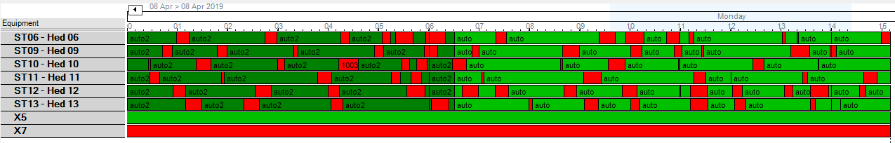

#### RAGGRUPPAMENTI PER CATEGORIA

È possibile raggruppare i gantt per categoria spuntando la voce `Raggruppa GANTT per categorie`. In tale modo si ottiene il risultato mostrato nell'immagine sottostante.

| 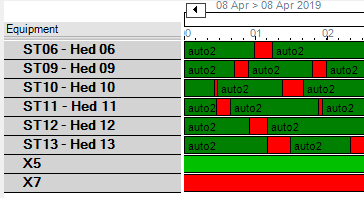 | 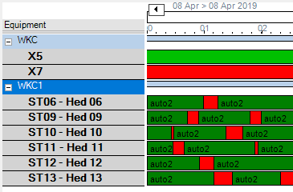 |
| :--: | ---- |
| GANTT non raggruppato per categoria | GANTT raggruppato per categoria |

### DETTAGLIO GANTT PER MACCHINE

Mostra il GANTT dei tempi macchina. I gantt posso essere raggruppati come di seguito descritto.

### RAGGRUPPAMENTO 1° LIVELLO

È possibile raggruppare i dati del dettaglio in 3 modi distinti, selezionabili dal box `Raggruppamento`:

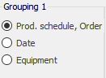

- Commessa, ODL
- Data
- Macchine

#### RAGGRUPPAMENTO PER COMMESSA - ODL

Raggruppa il dettaglio nel seguente modo:

Questo raggruppamento permette di vedere gli status macchina nel seguente modo:

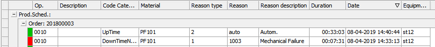

#### RAGGRUPPAMENTO PER DATA

Questo raggruppamento permette di raggruppare tutti gli eventi per singola data che rientra nel range di date impostate nel filtro iniziale.

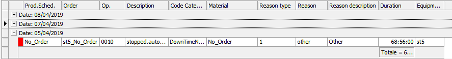

#### RAGGRUPPAMENTO PER MACCHINA

È il raggruppamento di default: gli status vengono raggruppati per macchina e ordinati secondo la data di evento. In altri termini, si tratta di una trasposizione in verticale del gantt stesso.

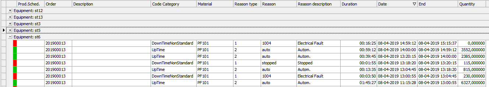

### RAGGRUPPAMENTO 2° LIVELLO

Per ogni raggruppamento descritto in precedenza, è possibile eseguire un raggruppamento di secondo livello scegliendo tra le seguenti opzioni poste nel box "*Raggruppamento 2*":

- Nessuno *(default)*
  Non viene applicato nessun raggruppamento di secondo livello;
- Causale
  Vengono raggruppati tutti le causali;
- Colore
  Vengono raggruppati in base al colore della causale.

#### MODIFICA DATI DEL GANTT MACCHINA

Sulla base delle indicazioni sotto riportare, è possibile agire manualmente su ogni riga mostrata in dettaglio al fine di modificare i tempi o eliminarli.

Selezionare la riga per la quale si desidera modificare i tempi e cliccare sul tasto : tale operazione comanda l'apertura della maschera che mostra la riga della causale e i relativi tempi.
Ora è possibile eseguire le seguenti operazioni:

1. Modificare una riga;
2. Creare una nuova riga di causale;
3. Unire più righe di causale.

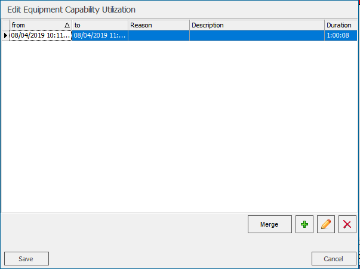

Per quanto concerne i punti 1 e 2, qualora si apporti una modifica temporale, è IMPORTANTE sapere che bisogna sempre rispettare il tempo totale che la macchina ha calcolato. Quindi, nel caso 1, se si modifica l'ora d'inizio e quella di fine, ne consegue che la durata deve rimanere invariata. Nel caso del punto 2, si può creare una nuova riga solo in relazione alla riduzione temporale di un tempo già esistente, mantenendo la somma dei tempi uguale a quella iniziale.

#### MODIFICARE UNA RIGA

Per modificare una riga, selezionarla e cliccare sul tasto , in modo da comandare l'apertura dell'editor:

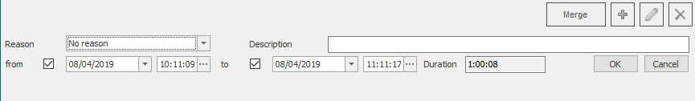

Ora è possibile modificare i contenuti.

Nel caso in cui si desideri modificare le date, è consigliabile fare attenzione a quanto premesso.

Cliccare su `OK` per rendere effettive le modifiche.

#### CREARE UNA NUOVA RIGA DI CAUSALE

Per impostare una nuova causale è necessario eseguire l'operazione di modifica appena descritta perché, come spiegato in premessa, si deve ridurre l'arco temporale della prima causale per far spazio a quella che si va a inserire. Questa accortezza è necessaria affinché, dall'unione delle due causali, il risultato sia sempre il tempo totale. Per facilitare questa operazione, una volta cliccato sul tasto
, il sistema crea una nuova riga di causale, il cui tempo è risultato della differenza tra il tempo totale e quello espresso nella prima causale.

**Esempio**:

Supponiamo di voler modificare la causale "Fermo macchina" che va dal 12/01/2019 10:30:00 al 12/01/2019 10:45:00. La situazione è rappresentata come segue:

| Dal                 | Al                  | Causale        | Totale   |
|---------------------|---------------------|----------------|----------|
| 12/01/2019 10:30:00 | 12/01/2019 10:45:00 | Fermo macchina | 00:15:00 |

Cliccando sulla riga, e poi sul tasto , andiamo a modificare l'arco temporale come segue:

| Dal                 | Al                      | Causale        | Totale       |
|---------------------|-------------------------|----------------|--------------|
| 12/01/2019 10:30:00 | 12/01/2019 10:**35**:00 | Fermo macchina | 00:**05**:00 |

Il totale ora è di 5 minuti, pertanto possiamo inserire una nuova causale il cui tempo è di 10 minuti (10+5= 15 minuti iniziali). Quindi, cliccando si , il sistema creerà una nuova riga così composta:

| From                | To                      | Reason     | Total        |
|---------------------|-------------------------|------------|--------------|
| 12/01/2019 10:30:00 |                         | Stop       | 00:**05**:00 |
| 12/01/2019 10:35:00 | 12/01/2019 10:**45**:00 | New Reason | 00:**10**:00 |

#### UNISCI PIU' RIGHE

Una volta eseguita una divisione dei tempi, qualora si desiderasse unirli, si dovrà tenere premuto il tasto CTRL mentre si selezionano le righe con il mouse tramite il tasto `UNISCI`. In questo modo, il sistema unisce le causali sommando tutti i tempi e impostando la data minore e quella maggiore come data inizio e data fine.

### GANTT PER PERSONALE

Per visualizzare i gantt relativi al Personale è necessario cliccare sul tasto `Personnel` evidenziato in figura, poi impostare i filtri temporali di ricerca e, dopo ancora, cliccare sul tasto `Filtra`. In questo modo è possibile reperire le informazioni di tutte le persone assegnate al nodo prescelto. Qualora si volesse applicare un filtro per persona, è sufficiente inserire nel campo `Person` il codice
personale dell'operatore.

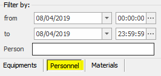

Analogamente a quanto avviene per le macchine, il sistema mostra i tempi lavorativi di ogni singolo operatore che rientrano nell'arco temporale impostato nel filtro di ricerca.

#### RAGGRUPPAMENTO

Il raggruppamento è simile a quello utilizzato per le macchine; tuttavia, in questo caso esso è impostato sul personale.

### ESPORTAZIONE DATI

Tutti i risultati possono essere esportati in Excel o stampati agendo
sui tasti `Esporta su Excel` e `Stampa`.
