# MAGAZZINO

## MOVIMENTI MAGAZZINO

| Icona | Funzionalità |
| ---- | :---- |
|  | La maschera movimenti di magazzino permette la visualizzazione di tutti i movimenti effettuati, come: rettifiche, produzioni ecc.. |

L'interfaccia dei movimenti di magazzino è di sola consultazione. Essa permette la visualizzazione dei seguenti dati:

- Movimenti
- Rettifiche
- Produzione
- BEM/ODS

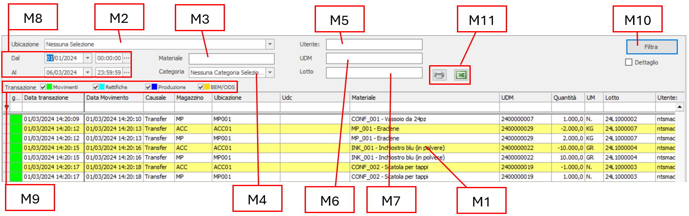

In **M1** sono presenti tutte le movimentazioni di magazzino, filtrabili con i seguenti parametri:

**M2** `Ubicazione` cliccare sul menu a tendina per fare apparire la struttura a nodi dello stabilimento, incluso la possibilità di scelta multipla. Cliccando sui vari nodi, indicheremo per quali ubicazioni desideriamo visualizzare i movimenti.

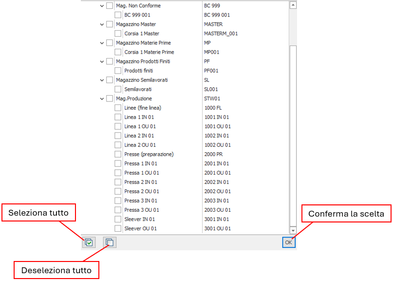

- **M3** `Materiale` digitare il codice del materiale.
- **M4** `Categoria` dal menu a tendina scegliere la categoria del materiale.
- **M5** `Utente` digitare il codice dell'Utente.
- **M6** `UDM` digitare il codice dell'UDM.
- **M7** `Lotto` digitare il codice del Lotto.
- **M8** impostare un *range* temporale di inizio / fine movimenti.

Tutti i risultati ottenuti possono essere ulteriormente filtrati in base alla loro tipologia.

| Colore | Tipologia |
| :---- | :-------- |
| &nbsp; | MOVIMENTI |
| &nbsp; | RETTIFICHE |
| &nbsp; | PRODUZIONE |
| &nbsp; | BEM/ODS |

Dopo aver impostato i filtri, è necessario cliccare sul tasto **M10** per avviare la ricerca.

I risultati così ottenuti possono essere esportati tramite i tasti **M11** in excel o avviati direttamente alla stampa 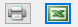.

## RICEVIMENTO MERCE

| Icona | Funzionalità |
| :---- | :---- |
|  | La maschera ricevimento merce permette di effettuare ordini di acquisto ed effettuare dei test sui materiali arrivati. |

Questa interfaccia è ricca di informazioni e permette di avere una visione completa dell'ordine e delle Udm in esso contenute. Come molte altre nella parte iniziale troviamo i filtri, in questo caso si riferiscono ai singoli ordini di acquisto:

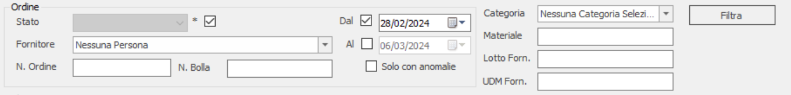

La seconda parte invece raggruppa tre tabelle:

### ORDINI, RIGHE ORDINI E UDM

Nella tabella `Ordini` vengono riportati tutti gli ordini di acquisto che rispettano i filtri sopra indicati. Ogni ordine può avere un colore associato **Rm7** che varia a seconda del suo stato.

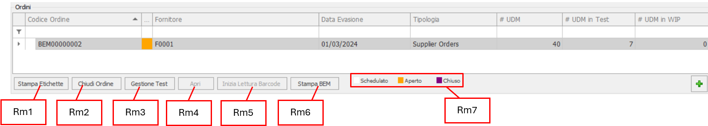

Per creare un nuovo ordine basta cliccare sul tasto  e si aprirà la seguente finestra:

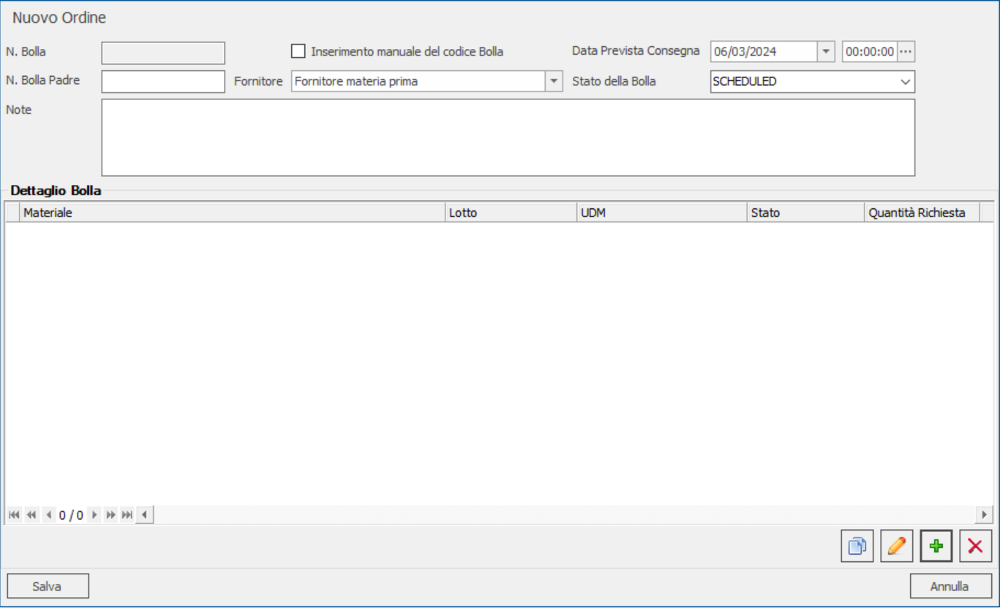

Una volta compilati i campi del nuovo ordine andando a cliccare sul nuovo tasto  si potranno aggiungere le righe dell'ordine, contenenti i materiali da acquistare.

All'interno della tabella *Righe Ordine* vengono, per l'ordine selezionato, visualizzate le righe che sono presenti al suo interno e corrispondono alla quantità totale ordinata di ogni materiale che a sua volta è suddivisa in più Udm. Ogni riga ha un suo stato **Rm10** che, più precisamente, varia a seconda della quantità ordinata.

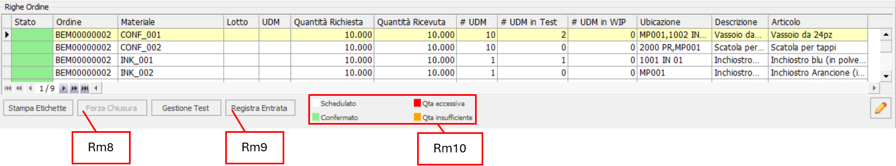

Cliccando sul tasto  si potrà modificare il prodotto contenuto all'interno della riga.

Infine, nell'ultima tabella vengono visualizzate, come accennato in precedenza, tutte le Udm nelle quali si divide ogni singola riga dell'ordine.

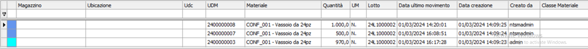

Le altre funzionalità presenti in questa sezione sono riportate di seguito:

- **Rm1** `Stampa Etichette` Stampa un'etichetta da associare all'ordine di entrata merci.
- **Rm2** `Chiudi Ordine` Passa lo stato dell'ordine da Aperto a Chiuso.
- **Rm3** `Gestione Test` Serve per creare un test per singola Udm.
- **Rm4** `Apri` Passa lo stato dell'ordine da Chiuso ad Aperto.
- **Rm5** `Inizia lettura Barcode` Inizializzazione lettura ordini tramite Barcode.
- **Rm6** `Stampa BEM` Stampa la Bolla Entrata Merce relativa agli ordini.
- **Rm8** `Forza Chiusura` Forza chiusura della riga dell'ordine.
- **Rm9** `Registra Entrata` Serve per spostare la merce arrivata in un magazzino di accettazione. Cliccando sul tasto si apre la seguente finestra:

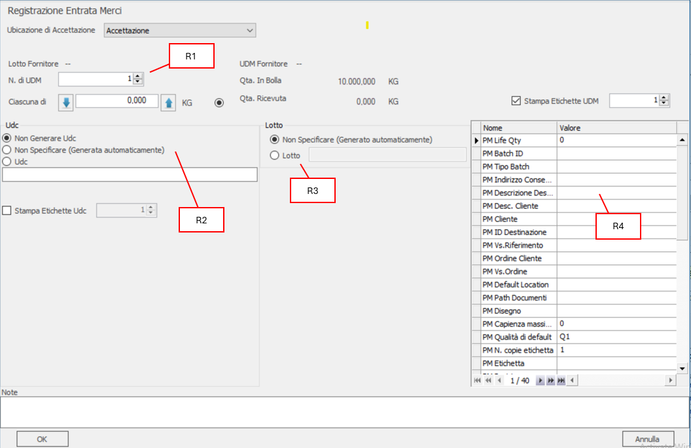

Al suo interno si potrà decidere il numero di Udm da spostare nel magazzino **R1** e se racchiuderle in un Udc **R2.**

Viene anche indicato il lotto a cui sono associati i materiali **R3** e infine vengono riportate le proprietà **R4** che potranno essere modificate in base al materiale trattato.

## SPEDIZIONI

| Icona | Funzionalità |
| :---- | :---- |
|  | All'interno di questa interfaccia vengono gestite le spedizioni. |

La struttura di questa sezione è molto simile a quella del `Ricevimento Merce`, infatti, nella prima parte troviamo i filtri:

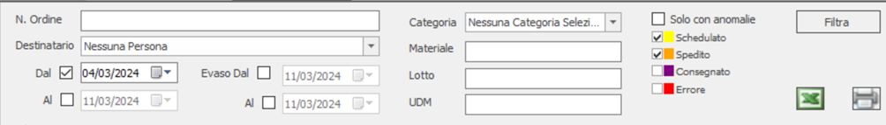

Successivamente troviamo tre tabelle:

### ORDINI

In questa tabella vengono riportati tutti gli ordini che rispettano i filtri scelti:

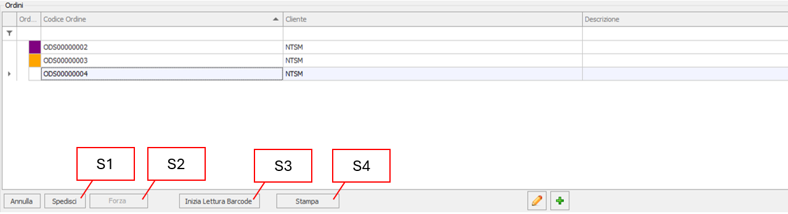

Cliccando sul tasto  si aprirà la seguente finestra, tramite la quale si potrà creare un nuovo ordine di spedizione:

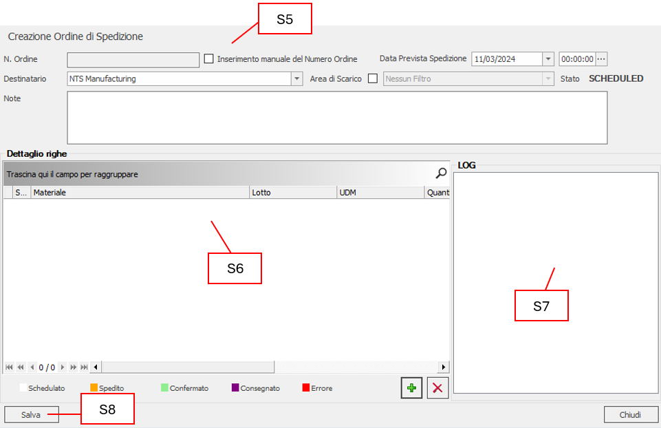

In alto vengono specificati tutti i dettagli da inserire all'interno dell'ordine **S5**, nel `Dettaglio righe` vengono riportati i materiali **S6** che verranno aggiunti all'ordine tramite lettura barcode oppure utilizzando il tasto , invece, nella casella `Log` **S7** verranno visualizzate tutte le azioni di carico/scarico che saranno utilizzate per aggiungere i materiali. Infine, una volta compilati tutti i campi, cliccando sul tasto `Salva` **S8**, il record verrà visualizzato nella tabella degli `Ordini`.

Utilizzando il pulsate `Inizia Lettura a Barcode` **S3**, si potranno andare a caricare, manualmente o tramite barcode, le quantità richieste all'interno delle righe dell'ordine:

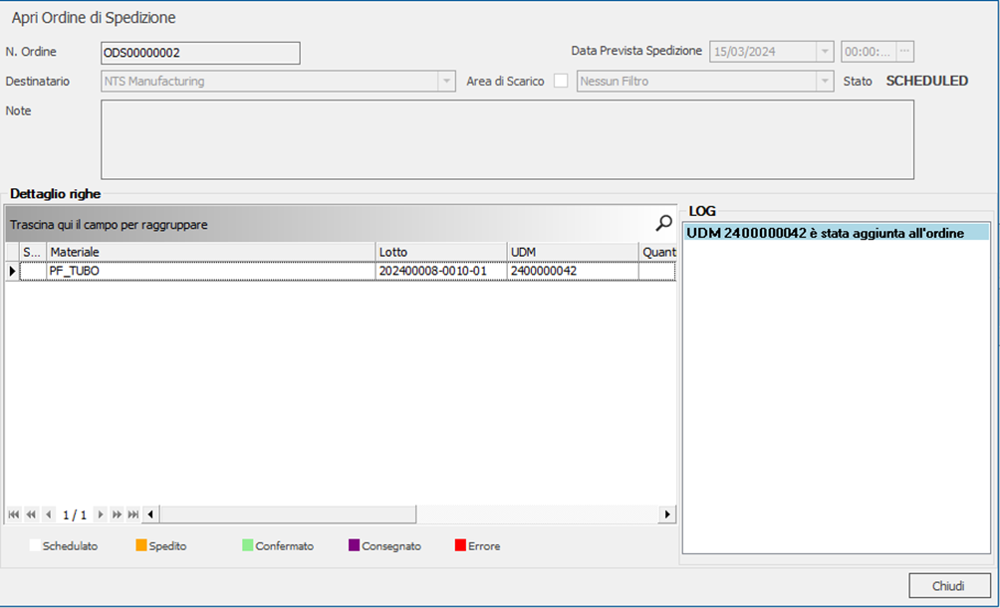

Una volta caricate tutte le Udm si potrà spedire l'ordine, cliccando sul tasto `Spedisci` **S1**, il quale cambierà stato del record in entrambe le tabelle in `Spedito` .

L'ordine poi una volta arrivato a destinazione oppure utilizzando il pulsante *Forza* **S2**, verrà visualizzato all'interno delle tabelle come *Consegnato* .

Il tasto *Stampa* **S4** servirà per stampare i singoli ordini.

### RIGHE ORDINE

Per ogni ordine selezionato verranno specificate all'interno di questa tabella tutte le Udm collegate con quell'ordine di spedizione.

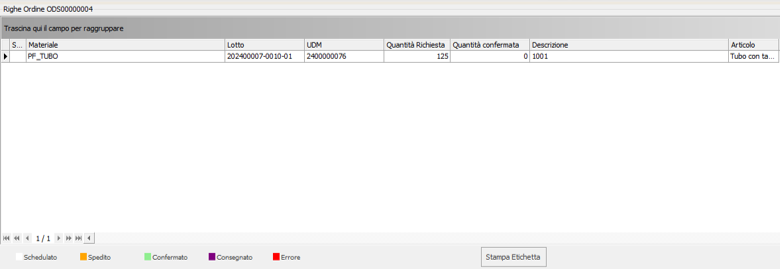

Lo stato delle righe cambierà in base a quello assegnato all'ordine a cui appartengono.

### STATO `MAGAZZINO`

Nella terza tabella viene riportato lo stato che assume la merce all'interno del magazzino, contenuta nell'ordine, fino alla sua spedizione:

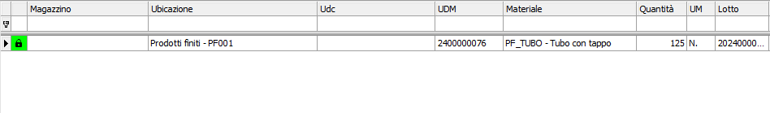

Se la riga dell'ordine è ancora scarica lo stato che apparirà sulla merce richiesta sarà `In Esecuzione` .

Se la riga dell'ordine è stata caricata con la quantità di merce richiesta, lo stato apparirà come `Da Confermare` .

Se l'ordine è stato consegnato, lo stato sarà `Confermato`  e l'Udm sarà cancellata all'interno dell'ubicazione.

Il lucchetto che è presente sugli stati delle Udm indica che la merce contenuta al suo interno è *Impegnata* e quindi non potrà essere utilizzata in altre attività finché assegnata ad un ordine di spedizione.

## SITUAZIONE MAGAZZINO

| Icona | Funzionalità |
| :---- | :---- |
|  | In questa maschera vengono visualizzate tutte le Udm presenti nei vari magazzini e vengono eseguiti i trasferimenti. |

L'interfaccia può essere filtrata con i seguenti campi:

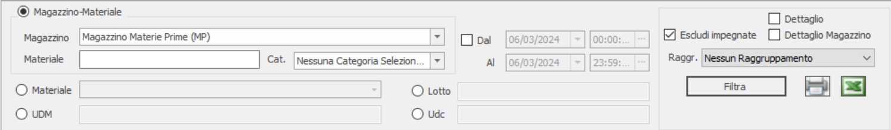

Selezionando il campo `Dettaglio` si aprirà una finestra all'interno della quale sarà possibile visualizzare tutte le informazioni che riguardano la tracciabilità del materiale:

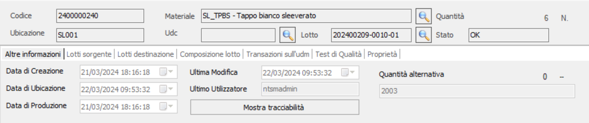

Cliccando sul pulsante `Mostra Tracciabilità` si aprirà un'interfaccia che descrive schematicamente tutto il processo che ha subito quella specifica Udm:

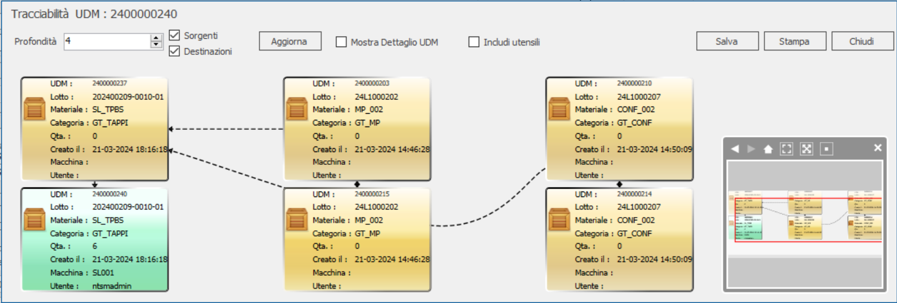

Nella tabella sottostante sono riportate le Udm inerenti al magazzino scelto nel filtro e che rispettano le condizioni imposte:

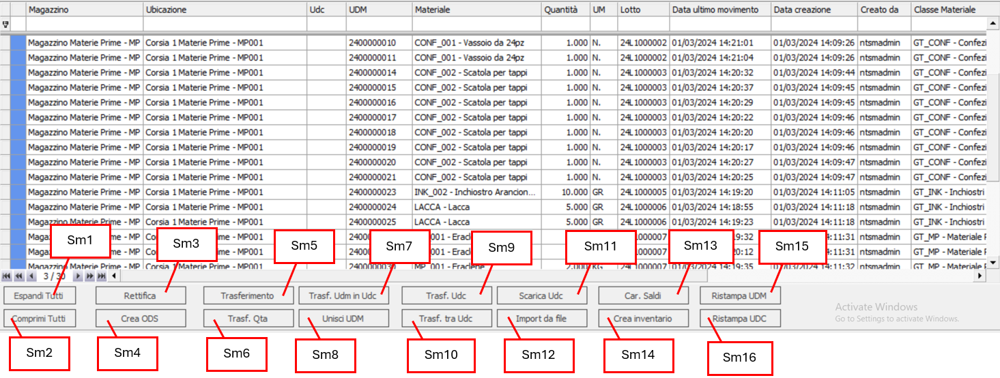

- **Sm1** `Espandi Tutti` Espande tutte le Udm.
- **Sm2** `Comprimi* *Tutti` Comprime tutte Udm.
- **Sm3** `Rettifica` Rettifica la quantità delle merci all'interno dell'Udm.
- **Sm4** `Crea ODS` Crea un nuovo ordine di spedizione.
- **Sm5** `Trasferimento` Trasferisce l'Udm in un altro magazzino.
- **Sm6** \[*Trasf. Qta*\] Trasferisce una determinata quantità all'interno di un altro magazzino.
- **Sm7** \[*Trasf. Udm in Udc*\] Mette più Udm all'interno di un'Udc.
- **Sm8** `Unisci UDM` Unisce più Udm in una sola.
- **Sm9** \[*Trasf. Udc*\] Trasferisce un'Udc all'interno di un altro magazzino.
- **Sm10** \[Trasf. *Tra Udc*\] Trasferisce le Udm contenute in un determinato Udc in un altro Udc.
- **Sm11** `Scarica Udc` Scarica delle Udm da un Udc.
- **Sm12** `Import da file` Permette di importare delle Udm all'interno dei magazzini tramite un file.
- **Sm13** \[*Car. Saldi*\] Carico dei Saldi contabili.
- **Sm14** `Crea Inventario` Creazione Inventario.
- **Sm15** `Ristampa UDM` Ristampa l'etichetta dell'Udm selezionato.
- **Sm16** `Ristampa UDC` Ristampa l'etichetta dell'Udc selezionato.

## GIACENZA MAGAZZINO

| Icona | Funzionalità |
| :---- | :---- |
| 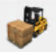 | Permette di visualizzare le rimanenze di magazzino. |

Nella maschera viene visualizzata una tabella con campi personalizzabili, filtrata con i valori che seguono:

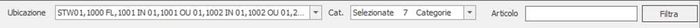

La tabella si presenterà in questo modo:

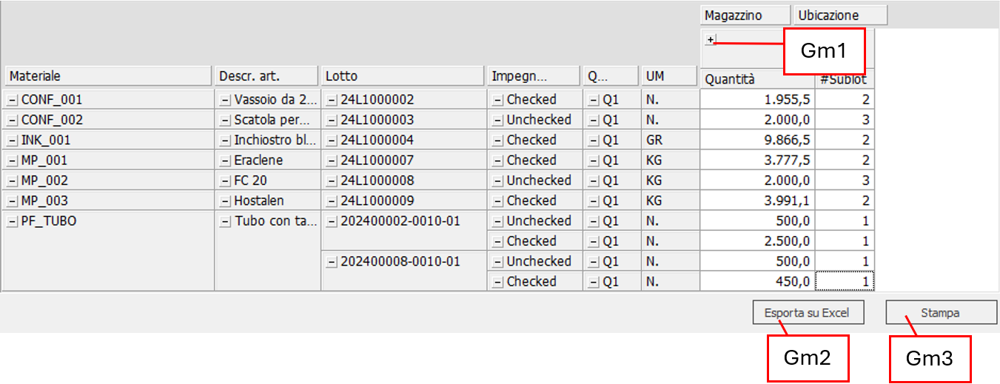

Cliccando il tasto **Gm1** si aprirà una sezione ancora più dettagliata della giacenza di magazzino:

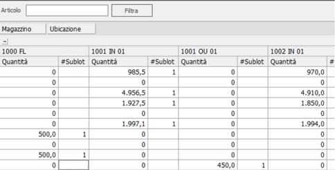

Infine, troviamo il tasto *Esporta su Excel* **Gm2,** che permette di scaricare la tabella e poi successivamente passarla su un foglio Excel, e il tasto *Stampa* **Gm3,** che servirà nel caso in cui si volesse stampare su foglio o in un file i dati visualizzati.
