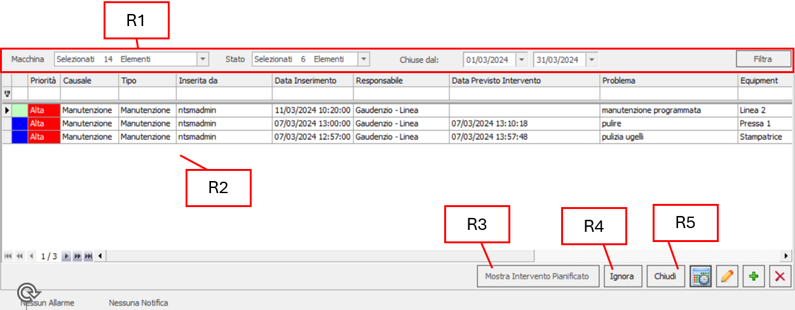
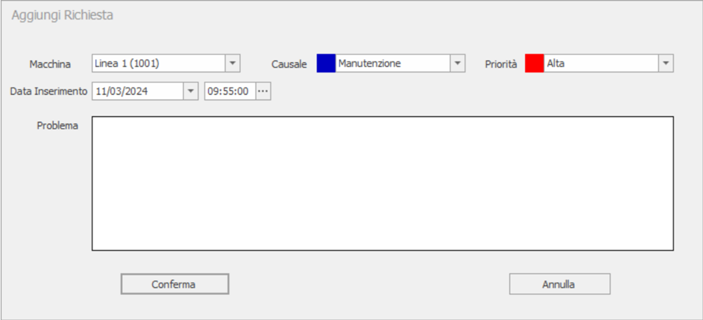
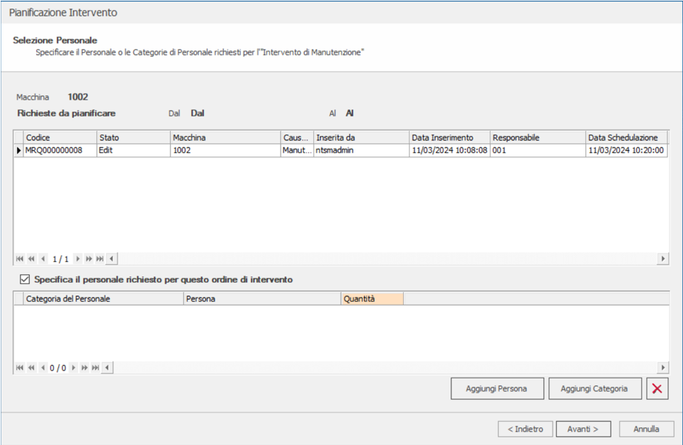
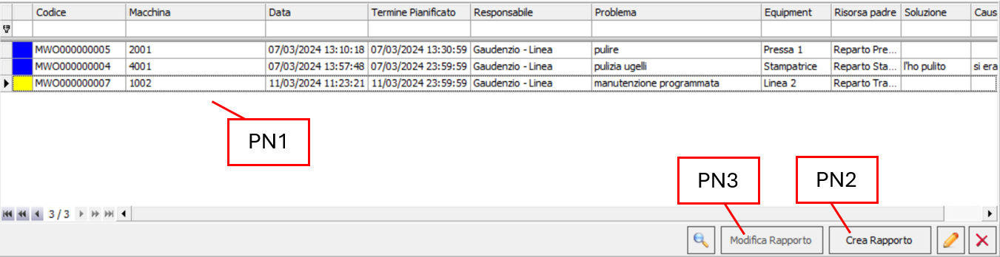
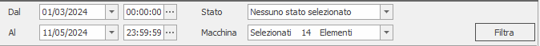
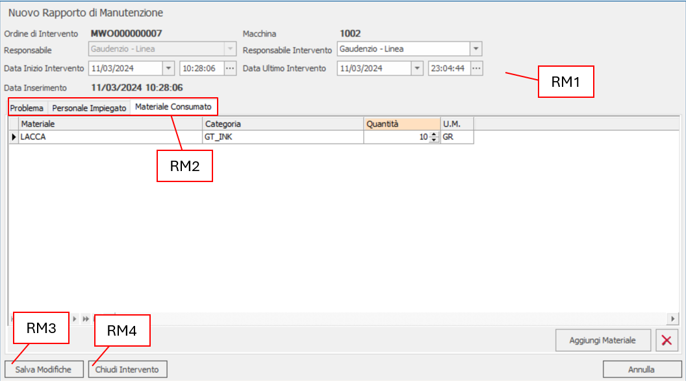
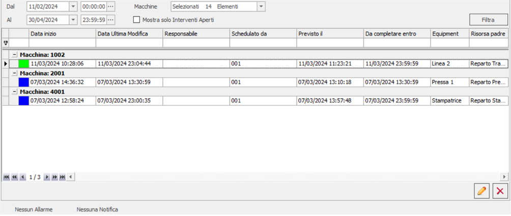

# MANUTENZIONE

| Icona | Funzionalità |
| :---- | :---- |
|  | All'interno di questa sezione vengono gestite le manutenzioni dei macchinari. |

## RICHIESTE

In questa interfaccia avviene la creazione delle richieste di manutenzione sulle macchine.

Nella tabella **R2** vengono visualizzate tutte le manutenzioni che rispettano i filtri sopra applicati **R1**. Cliccando sul tasto  si aprirà la seguente finestra che permetterà di creare una nuova richiesta:

Una volta compilata e cliccato il tasto `Conferma` verrà aggiunto, alla tabella **R2,** un nuovo record con lo stato `Edit` .

Successivamente alla creazione, lo stato del record potrà essere cambiato in `Ignored`  cliccando sul tasto `Ignora`
**R4**, e quindi la richiesta non potrà più essere avanzata, in `End`  tramite il pulsante `Chiudi`
**R5** oppure potrà essere avanzata in `Scheduled`  utilizzando il tasto , compilando tutti i campi delle schede elencate come segue:

Se la richiesta di manutenzione è ancora in avanzamento si può visualizzare il suo contenuto tramite il bottone `Mostra Intervento Pianificato` **R3**, invece, anche se la richiesta è terminata, si possono modificare i dati precedentemente compilati
 oppure eliminare direttamente il record .

## PIANIFICAZIONE

Quando sarà completata la fase di preparazione della richiesta, si potrà, tramite la seguente interfaccia, creare un rapporto di manutenzione:

Al suo interno si trova una tabella **PN1** che mostra le richieste che soddisfano i seguenti filtri:

Cliccando sul tasto `Crea rapporto` **PN2**, si aprirà la segue finestra tramite la quale avverrà la creazione di un nuovo rapporto:

Al suo interno vengono riportati i dettagli della richiesta **RM1,** che possono essere modificati, e tre sezioni **RM2,** nelle quali vengono rispettivamente specificati:

### PROBLEMA

Viene riportata la causa del problema e l'eventuale soluzione.

### PERSONALE IMPIEGATO

Viene gestito tutto il personale che è stato impegnato nello svolgimento di questa manutenzione.

### MATERIALE CONSUMATO

Viene elencato tutto il materiale utilizzato nel corso dell'operazione.

Infine, se si vuole chiudere la richiesta e quindi mandarla in `End` , cliccare il tasto `Chiudi Intervento` **RM4**; se si vuole salvare le modifiche e mandare in `Run`  la manutenzione, cliccare il tasto `Salva Modifiche` **RM3**.

Se, una volta creato il rapporto, si vuole modificarlo, utilizzare il tasto `Modifica Rapporto` **PN3**.

 Serve per visualizzare il rapporto associato alla richiesta una volta in `Run`.

 Va in modifica della richiesta che è ancora in `Scheduled`.

 Elimina l'intero Ordine di Intervento.

## ESECUZIONE

All'interno di questa interfaccia vengono visualizzate, raggruppate per macchina, tutte le manutenzioni che hanno o stanno eseguendo il loro processo lavorativo:

Il tasto `Modifica`  può essere  utilizzato, a differenza delle altre sezioni, anche sugli Ordini di Intervento che
sono in *End*; invece, il pulsante `Elimina`  può essere utilizzato solo sui record che ancora non hanno terminato il loro processo lavorativo.
