# QUALITA'

Questa sezione dell'applicazione consente la creazione di schede di test, aventi il fine di quantificare un livello di qualità.

I test possono essere relativi a lotti, materiali, macchine e personale.

## MODELLI COLLAUDI

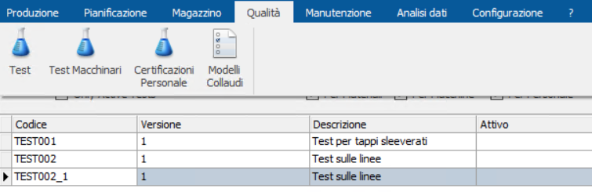

La prima operazione da eseguire è la definizione di uno o più `Modelli Collaudi`, attraverso cui vengono definiti i test da effettuare per la stima di un livello di qualità.

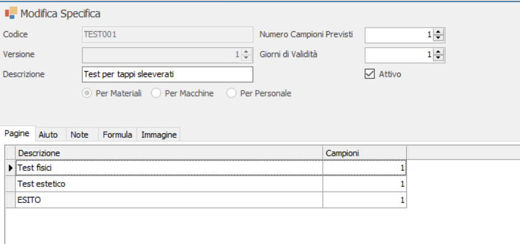

Un modello è composto da un codice, una descrizione, un numero di versione, un numero di campioni previsti, un numero di giorni di validità del test e la <u>categoria alla quale è associato (Materiali, Macchine o Personale)</u>.

Inoltre, nella parte bassa della pagina sono presenti le seguenti schede:

- PAGINE: un modello collaudo può essere associato a uno o più `Pagine`,   rappresentate da ciascuna riga della scheda `Pagine`. Ogni pagina raggruppa idealmente una serie di test (nell'esempio vediamo che sono   state create tre ‘pagine' di test: Test fisici, Test estetico ed ESITO). <u>Un test si traduce di fatto nel valorizzare una specifica proprietà</u>. La maschera per la creazione/modifica di una nuova Pagina comprende tre valori ereditati dalla ‘Pagina' di appartenenza e non modificabili (Test Materiali, Versione e numero pagina) e i campi modificabili Descrizione e Numero campioni (valore indicativo del numero dei campioni sul quale eseguire il test). Nella parte destra della form di creazione/modifica pagina, è presente la lista di proprietà da testare. Per aggiungere una nuova proprietà alla lista occorre premere il pulsante C1.

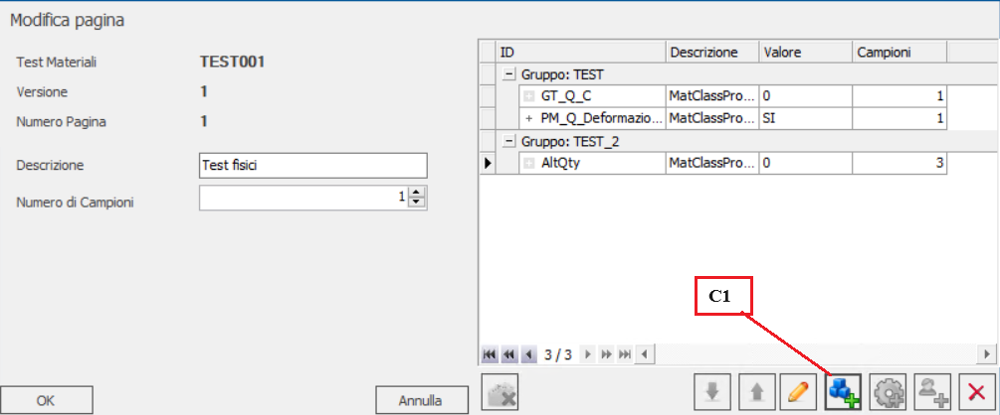

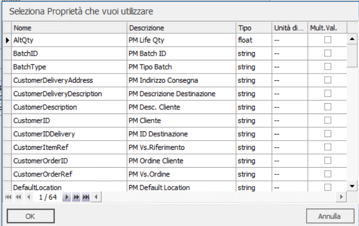

<u>In base alla categoria associata alla pagina selezionata (materiali, macchine e personale) verrà mostrato l'elenco di proprietà relative a quella categoria</u> (nell'esempio in questione la pagina `Test fisici` è relativa ai Materiali; perciò, la lista di proprietà visualizzate all'atto dell'inserimento di una nuova proprietà sarà l'elenco definito nella tabella ‘Proprietà delle Categorie di Materiali', nella sezione Configuratore - Materiale).

In base al tipo di dato associato alla proprietà, la maschera di aggiunta può variare. Indipendentemente dal tipo di proprietà, sarà sempre presente il campo ‘Gruppo', tramite cui è possibile raggruppare in vari livelli (gruppi) le proprietà associate ad una pagina di collaudo.

Nel caso in esempio il tipo di dato è ‘float', quindi un numerico. In caso quindi di valori numerici è possibile specificare le soglie Min. e Max. di valori ammissibili per l'esito positivo del test, in aggiunta al numero di campioni, ad un valore predefinito, al vincolo di aggiungere obbligatoriamente un valore o no. Infine, se viene selezionata la checkbox `Selezione Multipla` è possibile specificare un numero limitato di valori selezionabili in fase di collaudo. Al contrario, se la checkbox non è stata selezionata, sarà possibile inserire qualsiasi valore.

Infine, sono presenti le schede `Aiuto` (può contenere la descrizione delle operazioni che l'operatore dovrà eseguire ai fini del collaudo in questione) e ‘Azione Correttiva' (può contenere la descrizione delle operazioni da eseguire in caso di esito negativo del test).

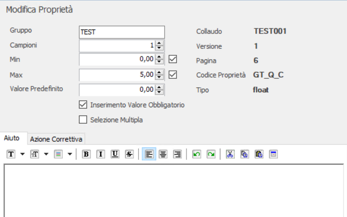

- AIUTO: può contenere una lista di operazioni che l'operatore dovrà svolgere;
- NOTE: eventuali note relative alla pagina;
- FORMULA; script con il quale è possibile calcolare automaticamente il livello di qualità, in base ai valori assunti dalle proprietà all'interno delle pagine del modello;
- IMMAGINE: eventuale immagine da associare al modello.

## TEST

Pagina relativa ai test su Materiali

### SPECIFICHE DI TEST PER MATERIALI

Questa tabella contiene la lista di tutti i test eseguibili sulla categoria ‘Materiali'.

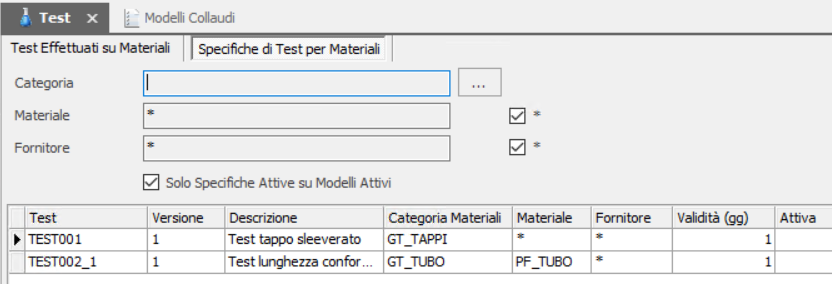

In fase di creazione di un nuovo test sono richiesti i seguenti campi: `Test` (codice identificativo del modello da utilizzare, precedentemente definito nella pagina `Modelli Collaudi`), `Versione` (numero di versione, definita all'interno del modello selezionato), `Categoria` (categoria, con relative proprietà, su cui applicare il test); `Materiale` (tipo di materiale, con relative proprietà, su cui applicare il test; nel caso fosse selezionata la checkbox, il test risulta applicabile a qualsiasi tipologia di materiale); `Fornitore` (fornitore, con relative proprietà, su cui applicare il test; nel caso fosse selezionata la checkbox, il test risulta applicabile a qualsiasi fornitore); `Macchina` (macchina, con relative proprietà, su cui applicare il test; nel caso fosse selezionata la checkbox, il test risulta applicabile a qualsiasi macchina); `Utilizzo Materiale` (tipo di utilizzo del materiale, a cui è applicato il test; nel caso fosse selezionata la checkbox, il test risulta applicabile a qualsiasi tipo di utilizzo); `Descrizione`.

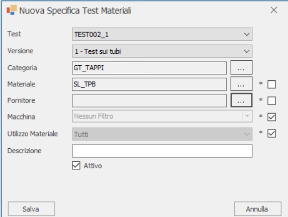

### TEST EFETTUATI SU MATERIALI

Tabella contenente l'elenco di tutti i test effettuati sui materiali.

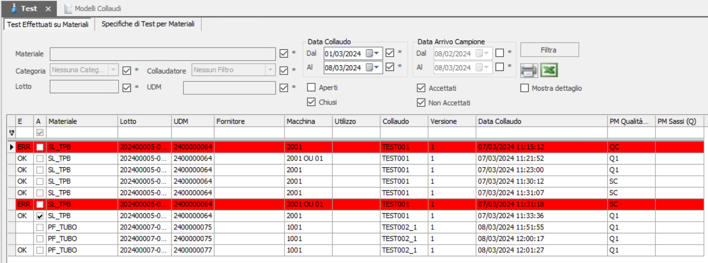

In fase di esecuzione di un nuovo test va innanzitutto specificato il codice UDM su cui si vuole eseguire il test. Appena inserito il codice all'interno del campo ‘UDM', nella sezione `Elenco Collaudi Compatibili` vengono proposti tutti i test compatibili con le caratteristiche di cui è composto l'UDM (di fatto vengono proposti tutti i test precedentemente definiti all'interno della pagina `Specifiche di test per materiali`, della stessa Categoria materiale e materiale dell'UDM selezionato).

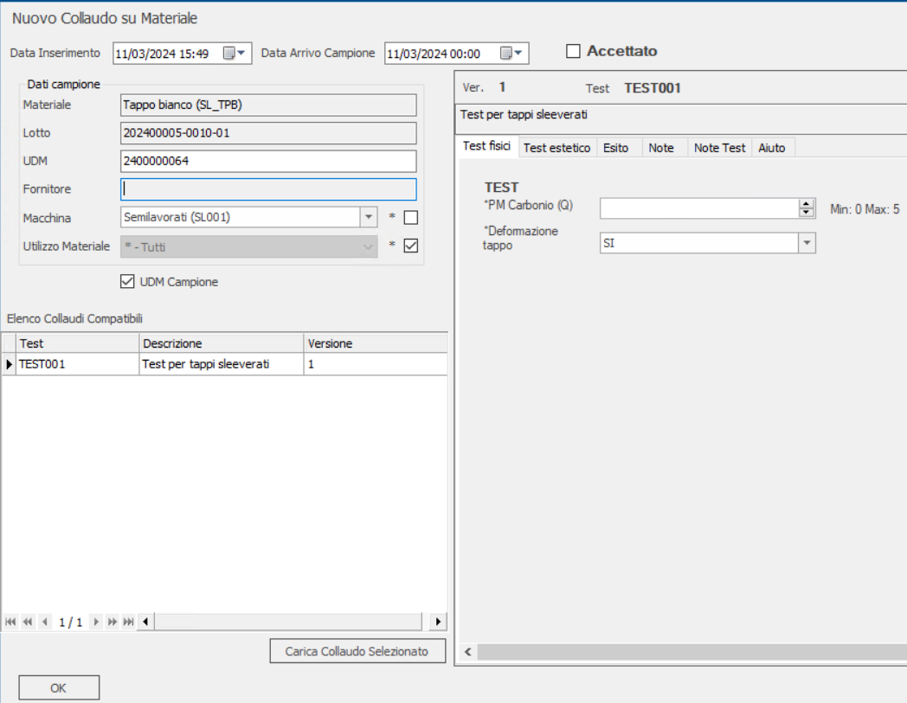

È anche possibile specificare la singola macchina su cui si vuole eseguire il test (se quindi in fase di creazione Specifica di test non fosse stata inserita la macchina selezionata da questa maschera, non verrebbe più mostrato il test tra quelli disponibili) o renderlo valido su qualsiasi macchina. Inoltre, può anche essere definito un preciso `Utilizzo Materiale` su cui effettuare il test, in caso contrario selezionando la casella il test sarà valido per qualsiasi tipo di utilizzo.

Nella parte destra della pagina vengono invece mostrate tutte le `Pagine` di cui è composto il modello della specifica di test selezionata (in questo caso `Test fisici`, `Test estetico` ed `Esito`), all'interno delle quali è possibile valorizzare le singole proprietà. A fianco delle Pagine sono mostrate anche le schede contenenti eventuali Note o helper del test.

Nel caso ci fossero più test compatibili, per selezionare quello di proprio interesse è sufficiente cliccare sulla riga relativa al test e quindi sul tasto `Carica Collaudo Selezionato`.

## TEST MACCHINARI

Pagina relativa ai test sulle macchine

### SPECIFICHE DI COLLAUDO PER MACCHINE

Questa tabella contiene la lista di tutti i test eseguibili sulla categoria `Macchine`.

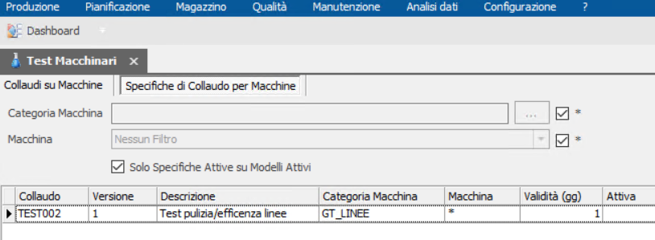

Un test macchina è caratterizzato dal campo `Test` (codice del `Modello Collaudo` di categoria `Macchina` da utilizzare), versione del modello, categoria macchina di applicabilità test, macchina specifica di applicabilità test (N.B.: un test può essere associato IN ALTERNATIVA a una categoria macchina o a una macchina specifica), descrizione.

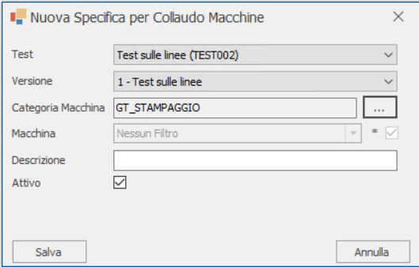

### COLLAUDI SU MACCHINE

Elenco di tutti i collaudi effettuati sulle macchine.

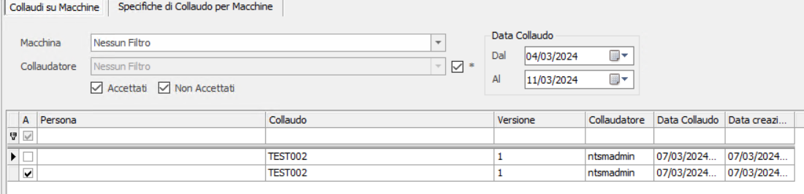

Per effettuare un nuovo collaudo è necessario in prima istanza specificare nel campo `Macchina`, la macchina su cui eseguire il test. Se per la macchina selezionata sono stati in precedenza definiti uno o più collaudi (attraverso la pagina `Specifiche di Collaudo per Macchine`), questi vengono mostrati nella tabella `Elenco Collaudi Compatibili`. Selezionando il collaudo d'interesse è quindi possibile valorizzare le proprietà sulle schede nella parte destra della pagina (in aggiunta ai campi Note, Note Test e Aiuto).

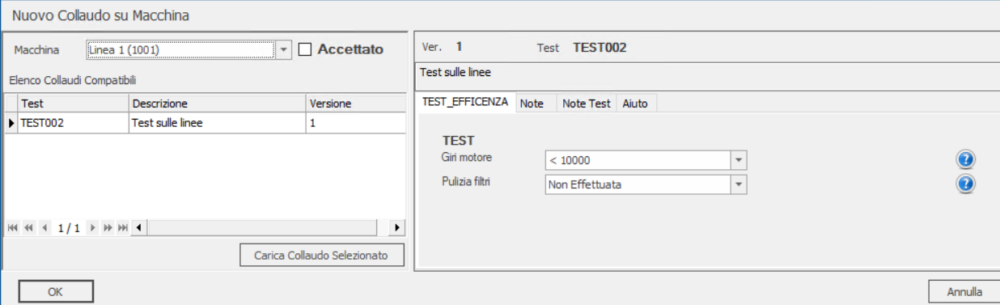

## CERTIFICAZIONI PERSONALE

Pagina relativa ai test di certificazione del personale.

### SPECIFICHE DI CERTIFICAZIONI PER IL PERSONALE

Questa tabella contiene la lista di tutti i test eseguibili sulla categoria ‘Personale'.

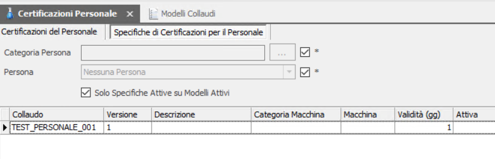

Un test certificazione personale è caratterizzato dal campo `Test` (codice del `Modello Collaudo` di categoria `Personale` da utilizzare), versione del modello, categoria di personale di applicabilità test, persona specifica di applicabilità test (selezionando la casella il test sarà associato a tutte le persone della categoria persona selezionata).

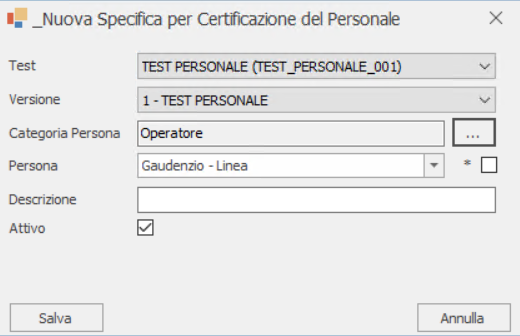

### CERTIFICAZIONI DEL PERSONALE

Elenco di tutti i test di certificazione effettuati sul personale.

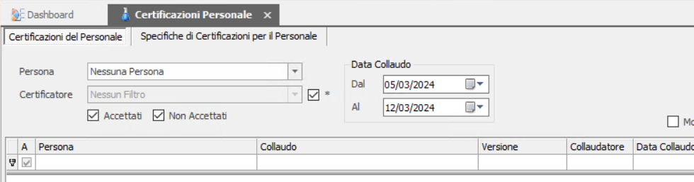

In fase di creazione di un nuovo test di certificazione occorre innanzitutto selezionare la categoria e quindi la persona specifica su cui eseguire la certificazione. Quindi, come per i test su materiali e macchine, dovranno essere valorizzate le proprietà caratterizzanti il test e gli eventuali campi `Note`, `Note test` e `Aiuto`.

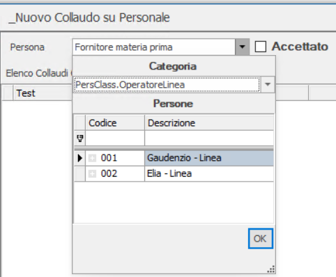

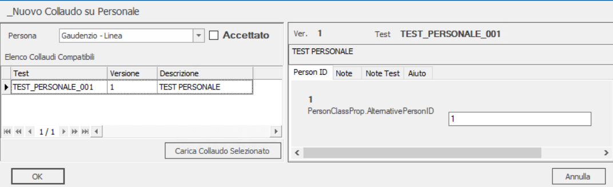
