# REPORT

| icona | funzionalità |
| ---- | ---- |
| 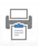 | In questa *form* è possibile visualizzare i report. |

La *form* dei report è divisa in due schede: REPORT e APPLICATION REPORT. Qui di seguitò è descritta la sola scheda REPORT, considerato che l'altra varia a seconda delle richieste del cliente.

La maschera dei report è suddivisa in due sezioni:

1. Elenco Report disponibili
2. Area Visualizzazione report

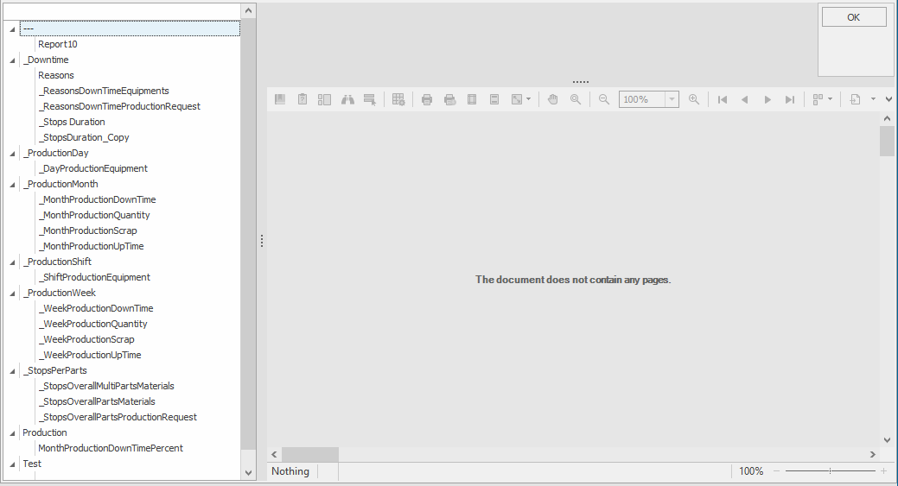

## ELENCO REPORT DISPONIBILI

L'elenco dei report disponibili è una struttura ad albero composta da 2 livelli. Il primo livello identifica il gruppo a cui appartiene il report, il secondo è il report stesso.

- Gruppo 1
  - Report A: Descrizione report A
  - Report B: Descrizione report B
- Gruppo 2
  - Report C: Descrizione report C
  - Report D: Descrizione report D

Cliccando sul nome del report, quest'ultimo appare nell'area visualizzazione report di seguito descritta.

## AREA VISUALIZZAZIONE REPORT

Dopo aver selezionato il report da visualizzare, quest'ultimo sarà mostrato in `Area visualizzazione Report`.

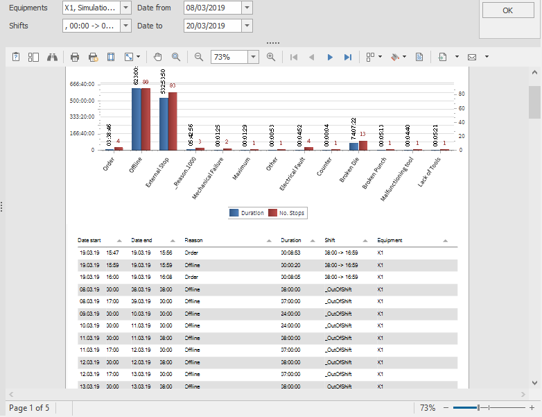

## AREA PARAMETRI

Prima della visualizzazione del report, potrebbe essere richiesto l'inserimento di quei parametri che influiscono sui contenuti del report stesso. Per esempio: date, numero ordini ecc.
I parametri sono disponibili nel riquadro `Parametri` evidenziato in VERDE SCURO.

Il report viene elaborato non appena immessi i parametri e cliccato sul tasto `OK`.

> [!IMPORTANT]
> Per velocizzare la consultazione di più report aventi stessi parametri, Il sistema memorizza le scelte immesse, che saranno riproposte in caso di uguaglianza di parametro.

**Esempio**:
Aprendo il report "REASON" viene richiesto l'ID dell'equipment per cui si desidera visualizzare i dati. Non appena tale dato viene inserito, il report viene elaborato. Qualora subito dopo si apra il report nominato "PRODUCTION", poiché anch'esso richiede preventivamente l'ID dell'equipment, quest'ultimo parametro risulta già precompilato come nell'ultimo inserimento.

## AREA MENÙ

Il menù del visualizzatore report (evidenziato in rosso) presenta le seguenti funzionalità:

| Icona | Descrizione |
| :---- | :---- |
| 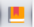 | Permette di visualizzare o meno la mappa del documento |
| 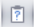 | Permette di visualizzare o meno l'area dei parametri |
| 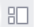 | Apre il box per la visualizzazione delle miniature delle pagine |
| 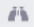 | Permette di ricercare del testo all'interno del report |
| 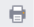 | Apre l'interfaccia di stampa |
| 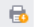 | Invia direttamente la stampa sulla stampante predefinita |
| 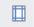 | Permette d'impostare i margini di stampa |
| 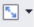 | Permette di scalare le dimensioni del report |
| 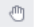 | Trasforma il cursore in una mano. Permette di esplorare e muoverti all'interno della singola pagina, in particolare quando viene zoomata |
| 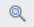 | Permette di eseguire, al primo click del tasto sinistro del mouse, uno zoom avanti e al secondo uno zoom indietro. |
| 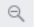 | Permette di eseguire uno zoom indietro |
| 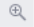 | Permette di eseguire uno zoom avanti |
|  | Naviga alla prima pagina della serie. |
| 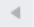 | Indietro di una pagina |
| 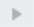 | Avanti di una pagina |
| 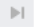 | Naviga all'ultima pagina della serie. |
| 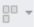 | Permette la visualizzazione multipla di pagine |
| 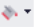 | Permette di modificare il colore dello sfondo del report |
| 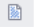 | Permette di applicare dei watermark al report |
| 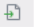 | Permette l'esportazione del report nel formato desiderato. Vedere i formati disponibili cliccando sulla freccia 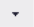 |
| 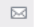 | Permette, d'inviare il formato convertito (nel formato prescelto) in allegato a un'e-mail |

> [!Note]
> LE PARTI DESCRITTE DI SEGUITO SONO DISPONIBILI IN: `CONFIGURAZIONE` 🡪 `REPORT`*

## FUNZIONALITÀ SUI REPORT

Le operazioni ammissibili nella *form* dei report sono le seguenti:

1. Modifica report
2. Inserisci nuovo report
3. Importa report dall'esterno
4. Esporta report
5. Cancella report.

E sono eseguibili rispettivamente tramite i seguenti tasti:

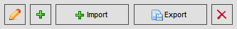

### MODIFICA REPORT

Dopo avere selezionato il report da modificare, cliccare sul tasto  per aprire la finestra di DESIGN del report. Ora si può procedere a modificare.

### INSERIMENTO NUOVO REPORT

Cliccare sul tasto 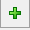 fa aprire la vista di DESIGN del report. Ora il report è pronto per essere creato.

### REPORT DESIGNER

Quando si crea o si modifica un report, il report è aperto in una maschera denominata REPORT DESIGNER, che permette di "disegnare" il proprio report sia nella grafica sia nei contenuti. Analogamente, il collegamento con la base dati rende possibile anche la creazione di query specifiche e parametrizzate. La mascherata di designer è rappresentata come nell'immagine sottostante:

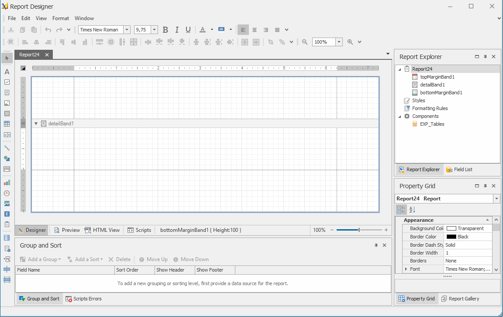

In questo contesto sono analizzate una parte delle caratteristiche.

- Come associare un report ad un gruppo di report
- Come associare ad un report un nome identificativo ed una descrizione
- Come rendere possibile la traduzione dei contenuti in modo dinamico
  Per l'utilizzo approfondito di questa funzione, si rimanda all'apposito manuale.

### PROPRIETÀ DEL REPORT

Per selezionare un elemento si può procedere in due modi: cliccare sull'elemento grafico (per esempio su una label), oppure ricercare tra tutti gli elementi che compongono il report. In quest'ultimo caso, si clicca sulla tendina, in testa al box delle proprietà, e si seleziona l'elemento di cui si desidera modificare le proprietà.

(Per impostare la funzione, selezionare il campo dalla lista dei campi disponibili. Qualora questa lista non fosse visibile, allora attivarla tramite: `Visualizza` 🡪 `Finestre` 🡪 `Lista Campi`.)

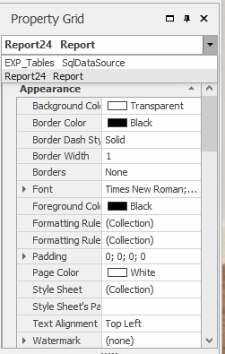

Le proprietà descritte in questa sezione sono le seguenti:

- PROGETTAZIONE
  - **Nome** (stringa): Identifica il nome dell'elemento selezionato. Nel caso in cui l'elemento coincida con il report stesso, allora il valore immesso determinerà il gruppo di appartenenza del report.
- NAVIGAZIONE
  - **Segnalibro** (stringa): Identifica il segnalibro dell'elemento selezionato. Nel caso in cui l'elemento coincida con il report stesso, allora il valore immesso determinerà il gruppo di appartenenza del report.
- DATI
  - **Tag** (stringa): nel campo tag va inserita la stringa che determina la traduzione del valore riportato nel campo "Testo". Il formato del tag è così composto:

**\${valore}**

Il tag deve sempre iniziare con **\${** e finire con **}** Il suo valore determinerà la chiave di ricerca per la traduzione. L'elenco dei tag disponibili è situato in
`Configurazione` 🡪 `Configuratore` 🡪 `Generale` 🡪 `Traduzioni`.

## LOCALIZZARE ELEMENTI CON CONTENUTO DINAMICO

Per localizzare gli elementi dinamici, come per esempio dei campi calcolati, <u>non si dovrà utilizzare il campo tag</u>, bensì agire direttamente sul valore dell'elemento tramite la funzione `Translate`.

(Per impostare la funzione, selezionare il campo dalla lista dei campi disponibili. Qualora questa lista non fosse visibile, attivarla tramite: `Visualizza` 🡪 `Finestre` 🡪 `Lista Campi`.)

Di seguito un esempio di lista di campi. Da notare che possiamo applicare funzioni personalizzate ai soli campi di tipo calcolato, rappresentati dalle icone che non hanno la banda arancione in testa.

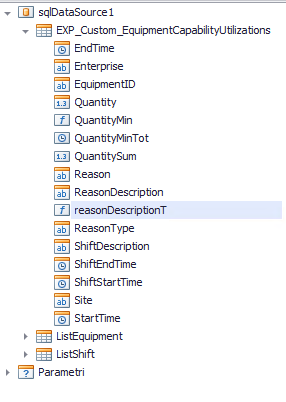

Nell'esempio, `ReasonDescriptionT` è un campo calcolato, pertanto lo si può tradurre tramite la funzione `Translate()`. Per eseguire questa operazione, cliccare con il tasto destro del mouse sul campo; selezionare la voce `Modifica Espressione` dal menu a tendina, al fine di aprire l'editor di espressioni; procedere a selezionare la
funzione di traduzione.

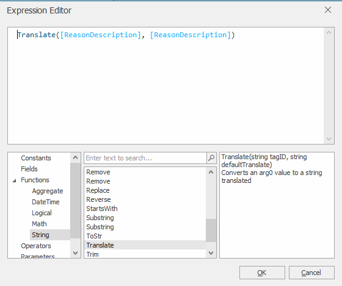

Sotto la voce `Funzioni` 🡪 `Stringa` è disponibile la funzione `Translate`, rappresentata come segue:

- `Translate`(TagID, DefaultTranslate)
- `TagId`: Identifica il codice univoco del tag da tradurre. L'elenco dei tag disponibili è in `Configurazione` 🡪 `Configuratore` 🡪 `Generale` 🡪 `Traduzioni`
- `DefaultTranslate`: è la stringa di default da utilizzare nel caso in cui il tag non abbia una traduzione.

### IMPORTA REPORT DALL'ESTERNO

Cliccare sul tasto 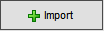 per aprire la classica
maschera di esplora risorse di windows, che permette di selezionare il
report da importare. L'unico formato file ammissibile è .repx

### ESPORTARE REPORT

Dopo aver selezionato il report da esportare, cliccando sul tasto 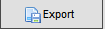, si aprirà la classica maschera di esplora risorse di Windows che permetterà di salvare il report in formato `.repx`

### CANCELLARE REPORT

Dopo aver selezionato il report da cancellare, cliccando sul tasto 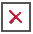 e confermando la volontà di eliminare il report, quest'ultimo verrà definitivamente eliminato dalla lista.
