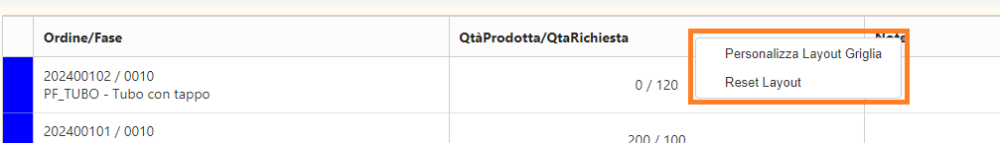
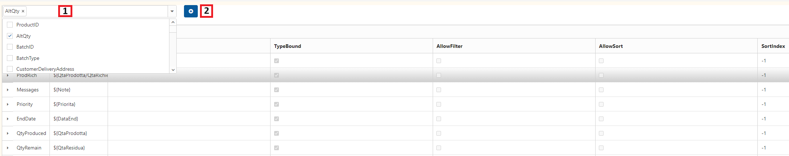

# GESTIONE GRIGLIE

Cliccando con il tasto destro sopra l'intestazione di una griglia, apparirà il seguente menù a tendina, attraverso cui sarà possibile personalizzare la visualizzazione della griglia:

Selezionando `Personalizza Layout Griglia` apparirà la pagina di personalizzazione griglia mostrata nell'immagine seguente, mentre
cliccando `Reset Layout` verrà ripristinato il layout di default della griglia.

Utilizzando il menu a tendina `1` è possibile selezionare le colonne da aggiungere in visualizzazione; quindi, cliccando il tasto `2` si conferma l'aggiunta delle colonne. Mediante la griglia sottostante è possibile modificare le caratteristiche di ciascuna colonna, come la descrizione visualizzata, l'abilitazione di filtri e ordinamento...
